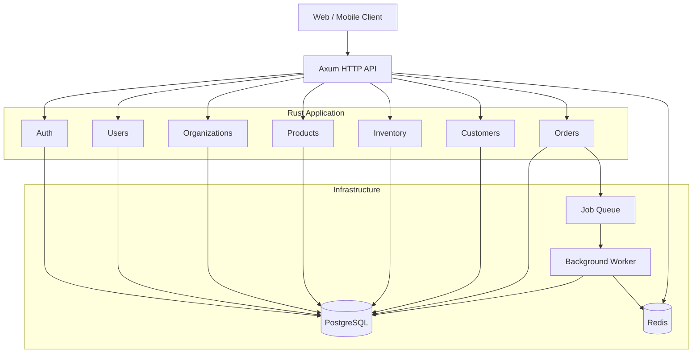

# 🛒 Multi-Tenant E-Commerce SaaS Backend

> A production-oriented multi-tenant e-commerce SaaS backend built with **Rust, Axum, PostgreSQL, SQLx, Redis, and Docker**.
>
> Designed as a **modular monolith** using **Hexagonal Architecture (Ports & Adapters)**, with explicit domain boundaries, tenant isolation, transactional workflows, concurrency-safe inventory management, and production-focused observability.

<p align="center">


</p>

---

## 📋 Table of Contents

* [Overview](#-overview)
* [Engineering Highlights](#-engineering-highlights)
* [Architecture](#-architecture)
* [Architectural Boundaries](#-architectural-boundaries)
* [Project Structure](#-project-structure)
* [Module Structure](#-module-structure)
* [Dependency Direction](#-dependency-direction)
* [Authentication](#-authentication)
* [Authorization](#-authorization)
* [Multi-Tenancy](#-multi-tenancy)
* [Database Architecture](#-database-architecture)
* [Transactions](#-transactions)
* [Concurrency](#-concurrency)
* [Caching](#-caching)
* [Background Jobs](#-background-jobs)
* [Error Handling](#-error-handling)
* [API Design](#-api-design)
* [Security](#-security)
* [Testing](#-testing)
* [Observability](#-observability)
* [Local Development](#-local-development)
* [Docker](#-docker)
* [CI/CD](#-cicd)
* [Performance](#-performance)
* [Failure Handling](#-failure-handling)
* [Architecture Decision Records](#-architecture-decision-records)
* [Production Checklist](#-production-checklist)
* [Roadmap](#-roadmap)
* [License](#-license)

---

# 🚀 Overview

This project is a **multi-tenant e-commerce SaaS backend** written in Rust.

Multiple independent organizations can use the same application while their business data remains logically isolated.

The system is built as a **modular monolith**.

Instead of distributing every business capability into a separate service, each capability is represented as an independent module with explicit architectural boundaries.

Current business modules include:

```text
Auth
Users
Organizations
Products
Inventory
Customers
Orders
```

Each module follows a **Ports & Adapters** structure:

```text
domain
feature
port
adapter
```

This keeps business rules and use cases separated from infrastructure concerns such as PostgreSQL, Redis, HTTP, and external services.

---

# 🏆 Engineering Highlights

The project focuses on backend engineering problems beyond basic CRUD.

### 🏢 Multi-Tenancy

* Explicit tenant context
* Tenant-scoped data access
* Organization membership
* Tenant-aware authorization
* Cross-tenant access prevention
* Tenant isolation testing

### 🔐 Security

* Argon2 password hashing
* Short-lived access tokens
* Refresh-token lifecycle management
* Token revocation
* Role-based authorization
* Resource-level authorization
* Secure error handling

### 💳 Consistency

* Transactional order creation
* Inventory validation
* Database constraints
* PostgreSQL as the source of truth
* Explicit transaction boundaries

### ⚔️ Concurrency

* Row-level inventory locking
* Transaction-safe stock updates
* Protection against overselling
* Concurrency integration tests

### ⚡ Performance

* SQLx connection pooling
* Redis caching
* Pagination
* Tenant-aware indexes
* Avoidance of N+1 queries

### 🔭 Operations

* Structured logging
* Request IDs
* Prometheus metrics
* Health checks
* Docker
* CI/CD
* Graceful shutdown

---

# 🏗️ Architecture

The system combines two architectural concepts:

```text
Modular Monolith
       +
Hexagonal Architecture
       =
Business modules with explicit boundaries
```

High-level architecture:



---

# 🧱 Architectural Boundaries

The source tree is organized around four top-level responsibilities:

```text
src/
├── app/
├── infrastructure/
├── modules/
└── shared/
```

Each has a deliberately different responsibility.

---

## `app/`

The `app` layer is responsible for **application composition**.

Typical responsibilities:

* Router construction
* Application state
* Dependency wiring
* Middleware registration
* Server startup
* HTTP composition

Conceptually:

```text
app
 ├── router
 ├── state
 └── startup
```

The `app` layer connects the system together.

It should not contain core business rules.

---

## `modules/`

`modules` contains the actual business capabilities of the platform.

```text
modules/
├── auth/
├── users/
├── organizations/
├── products/
├── inventory/
├── customers/
└── orders/
```

Each module owns a specific business capability.

For example:

```text
products
```

owns product-related rules and use cases.

```text
inventory
```

owns inventory-related rules and operations.

```text
orders
```

owns order creation, order state, order calculations, and order workflows.

---

## `infrastructure/`

Infrastructure contains technical implementations.

Typical responsibilities include:

```text
infrastructure/
├── database/
├── redis/
├── authentication/
├── jobs/
└── observability/
```

Infrastructure knows about technologies.

For example:

```text
PostgreSQL
Redis
SQLx
JWT libraries
Message queues
Prometheus
```

Business logic should not need to know how those technologies are implemented.

---

## `shared/`

`shared` contains small primitives that are genuinely shared between modules.

Examples:

```text
shared/
├── error/
├── pagination/
├── response/
├── validation/
└── types/
```

`shared` should remain intentionally small.

It should not become a generic dumping ground for unrelated utilities.

---

# 📁 Project Structure

```text
src/
├── main.rs
│
├── app/
│   ├── mod.rs
│   ├── router.rs
│   ├── state.rs
│   └── startup.rs
│
├── infrastructure/
│   ├── database/
│   ├── redis/
│   ├── authentication/
│   ├── jobs/
│   └── observability/
│
├── modules/
│   ├── auth/
│   ├── users/
│   ├── organizations/
│   ├── products/
│   ├── inventory/
│   ├── customers/
│   └── orders/
│
└── shared/
    ├── error/
    ├── pagination/
    ├── response/
    ├── validation/
    └── types/

migrations/
tests/
docs/
docker/
```

> The exact files may evolve as the project grows; the important invariant is the separation of responsibilities.

---

# 🧩 Module Structure

Every business module follows the same four-part architecture:

```text
modules/
└── orders/
    ├── domain/
    ├── feature/
    ├── port/
    └── adapter/
```

This is the core architectural decision of the project.

---

# 🧠 `domain/`

The `domain` layer contains the **business model and business invariants**.

Typical contents:

```text
domain/
├── entity
├── value_object
├── domain_error
└── business_rules
```

Examples:

```text
Order
OrderItem
OrderStatus
Money
Quantity
```

The domain should not depend on:

```text
Axum
PostgreSQL
SQLx
Redis
HTTP
JWT
```

The purpose is to keep the core business model independent from technical implementation details.

---

# 🎯 `feature/`

The `feature` layer contains **application use cases**.

Examples:

```text
CreateOrder
CancelOrder
GetOrder
ListOrders

CreateProduct
UpdateProduct
DeleteProduct

AdjustInventory
GetInventory
```

The feature layer answers:

> **What can the system do?**

It coordinates the domain objects and required ports to execute a business operation.

Conceptually:

```text
HTTP Request
     │
     ▼
Feature
     │
     ├── Domain Rules
     │
     └── Ports
            │
            ▼
         Adapter
```

---

# 🔌 `port/`

Ports define the boundaries between business logic and external systems.

Examples:

```text
port/
├── repository.rs
├── cache.rs
├── event.rs
├── clock.rs
└── authentication.rs
```

A port describes **what the application needs**, without specifying how the dependency works.

Example:

```rust
#[async_trait]
pub trait OrderRepository {
    async fn create(&self, order: &Order) -> Result<(), RepositoryError>;
    async fn find_by_id(
        &self,
        tenant_id: TenantId,
        order_id: OrderId,
    ) -> Result<Option<Order>, RepositoryError>;
}
```

The feature layer depends on the abstraction.

It does not need to know whether the implementation uses PostgreSQL, an in-memory database, or another persistence mechanism.

---

# 🔧 `adapter/`

Adapters implement the ports.

Examples:

```text
adapter/
├── postgres/
├── redis/
├── http/
└── messaging/
```

For example:

```text
port/
└── OrderRepository

        ▲
        │ implements
        │
adapter/
└── PostgresOrderRepository
```

This is where technology-specific code lives.

---

# 🔄 Dependency Direction

The intended dependency direction is:

```text
                  ┌─────────────┐
                  │   Adapter   │
                  └──────┬──────┘
                         │
                    implements
                         │
                         ▼
                  ┌─────────────┐
                  │    Port     │
                  └──────▲──────┘
                         │
                      depends
                         │
                         ▼
                  ┌─────────────┐
                  │   Feature   │
                  └──────┬──────┘
                         │
                      uses
                         │
                         ▼
                  ┌─────────────┐
                  │   Domain    │
                  └─────────────┘
```

The key principle is:

> **Business logic defines what it needs; infrastructure decides how to provide it.**

---

# 🔐 Authentication

Authentication follows a short-lived access-token and refresh-token model.

```text
Login
  │
  ▼
Validate Credentials
  │
  ▼
Create Session
  │
  ├── Access Token
  │
  └── Refresh Token
```

Passwords are hashed using Argon2.

Access tokens are short-lived.

Refresh tokens support:

* Rotation
* Expiration
* Revocation
* Session association
* Reuse detection

---

# 🔑 Authorization

Authorization is separate from authentication.

```text
User
 │
 ▼
Organization Membership
 │
 ▼
Role
 │
 ▼
Permission
 │
 ▼
Resource Authorization
```

Example:

```text
ADMIN
├── products.read
├── products.write
├── inventory.read
├── inventory.write
├── orders.read
└── orders.write
```

Authorization should be evaluated before protected business operations execute.

---

# 🏢 Multi-Tenancy

The application uses a **shared database / shared schema** model.

Tenant-owned records contain a tenant identifier.

Example:

```sql
CREATE TABLE products (
    id UUID PRIMARY KEY,
    tenant_id UUID NOT NULL,
    name TEXT NOT NULL,
    price NUMERIC(12, 2) NOT NULL,
    created_at TIMESTAMPTZ NOT NULL DEFAULT NOW()
);
```

Tenant context flows through the request:

```text
Request
   │
   ▼
Authentication
   │
   ▼
Tenant Resolution
   │
   ▼
Authorization
   │
   ▼
Feature
   │
   ▼
Tenant-aware Port
   │
   ▼
Adapter
   │
   ▼
PostgreSQL
```

Queries must always include the tenant boundary.

```sql
SELECT *
FROM products
WHERE tenant_id = $1
  AND id = $2;
```

---

# 🔒 Tenant Isolation

Tenant isolation is treated as a security boundary.

For example:

```text
Tenant A
   │
   │ requests Product B
   ▼
Tenant-scoped repository
   │
   ▼
tenant_id = A
   │
   ▼
Product B not visible
   │
   ▼
404 Not Found
```

Cross-tenant access should be explicitly tested.

Examples:

```text
Tenant A cannot read Tenant B products
Tenant A cannot modify Tenant B products
Tenant A cannot read Tenant B orders
Tenant A cannot modify Tenant B inventory
```

---

# 🗄️ Database Architecture

PostgreSQL is the **authoritative source of business data**.

The database is responsible for enforcing important invariants through:

* Foreign keys
* Unique constraints
* Check constraints
* Transactions
* Row-level locks
* Tenant-aware indexes

Example:

```sql
CREATE INDEX idx_products_tenant_created
ON products (tenant_id, created_at DESC);
```

---

# 💳 Transactions

Business operations involving multiple state changes should execute inside a transaction.

Order creation:

```text
BEGIN
  │
  ├── Validate customer
  ├── Validate products
  ├── Lock inventory
  ├── Validate stock
  ├── Calculate total
  ├── Create order
  ├── Create order items
  ├── Decrease inventory
  │
COMMIT
```

Any failure results in:

```text
ROLLBACK
```

This protects consistency between orders and inventory.

---

# ⚔️ Concurrency

Inventory is a critical concurrency boundary.

Example:

```text
Inventory = 1
```

Three users attempt to purchase simultaneously.

The database transaction locks the relevant inventory row:

```sql
SELECT quantity
FROM inventory
WHERE product_id = $1
FOR UPDATE;
```

Expected result:

```text
Request A → Success
Request B → Rejected
Request C → Rejected

Final inventory = 0
```

The database, rather than application timing, determines the serialization point.

---

# ⚡ Caching

Redis is used as a performance optimization.

Potential cache targets:

* Product details
* Product listings
* Organization settings
* Permission lookups
* Rate limits

Redis is **not** the authoritative store for business data.

```text
Request
  │
  ▼
Redis
  │
  ├── HIT ──► Response
  │
  └── MISS
       │
       ▼
   PostgreSQL
       │
       ▼
      Redis
```

---

# 🔄 Background Jobs

Long-running operations are moved outside the request lifecycle.

Examples:

* Email delivery
* Password reset
* Email verification
* Notifications
* Cleanup
* Cache warming

```text
Feature
   │
   ▼
Job Port
   │
   ▼
Queue Adapter
   │
   ▼
Worker
```

Jobs should be designed for:

* Idempotency
* Retry
* Backoff
* Failure handling
* Observability

---

# ❌ Error Handling

Errors are represented through a consistent application error model.

Example:

```rust
pub enum AppError {
    Validation,
    Unauthorized,
    Forbidden,
    NotFound,
    Conflict,
    Database,
    Internal,
}
```

HTTP mapping:

| Error        | Status |
| ------------ | -----: |
| Validation   |  `400` |
| Unauthorized |  `401` |
| Forbidden    |  `403` |
| Not Found    |  `404` |
| Conflict     |  `409` |
| Rate Limited |  `429` |
| Internal     |  `500` |

Internal infrastructure errors should be logged internally without exposing implementation details to clients.

---

# 🌐 API Design

API endpoints are versioned:

```text
/api/v1/auth
/api/v1/users
/api/v1/organizations
/api/v1/products
/api/v1/inventory
/api/v1/customers
/api/v1/orders
```

Example:

```http
GET /api/v1/products?page=1&limit=20
```

Response:

```json
{
  "data": [],
  "pagination": {
    "page": 1,
    "limit": 20,
    "total": 0
  }
}
```

The API aims for:

* Predictable HTTP semantics
* Consistent errors
* Explicit validation
* Pagination
* Stable response formats
* OpenAPI documentation

---

# 🔒 Security

Security follows defense in depth.

### Application

* Input validation
* Authorization
* Tenant isolation
* Rate limiting
* Secure error handling

### Authentication

* Argon2
* Short-lived access tokens
* Refresh-token rotation
* Token revocation
* Session management

### Database

* Parameterized SQL
* Constraints
* Foreign keys
* Transactions
* Least-privilege credentials

### Infrastructure

* TLS
* Secret management
* Non-root containers
* Minimal runtime images

---

# 🧪 Testing

Testing focuses on business behavior and failure scenarios.

## Unit Tests

Test:

* Domain rules
* Value objects
* Calculations
* Authorization
* Validation

## Integration Tests

Test:

* PostgreSQL repositories
* Redis adapters
* Transactions
* Database constraints
* Tenant isolation

## Security Tests

Examples:

```text
Tenant A cannot access Tenant B resources
Tenant A cannot modify Tenant B resources
Unauthorized users cannot execute protected features
Users cannot access organizations they do not belong to
```

## Concurrency Tests

Example:

```text
Initial inventory = 1

Concurrent purchases = 10

Expected successful purchases = 1
Expected rejected purchases = 9
Final inventory = 0
```

---

# 📊 Observability

The backend uses structured logging and metrics.

Example request log:

```text
INFO request completed
    request_id=7f31...
    tenant_id=...
    user_id=...
    method=POST
    path=/api/v1/orders
    status=201
    duration_ms=42
```

Sensitive values must never be logged.

Do not log:

```text
passwords
access tokens
refresh tokens
authorization headers
secrets
```

Recommended metrics include:

* HTTP request rate
* HTTP latency
* HTTP error rate
* Database latency
* Database pool usage
* Redis latency
* Authentication failures
* Order failures
* Background-job failures

---

# 💻 Local Development

## Requirements

* Rust
* Cargo
* Docker
* Docker Compose
* SQLx CLI

Start infrastructure:

```bash
docker compose up -d postgres redis
```

Run migrations:

```bash
sqlx migrate run
```

Start the application:

```bash
cargo run
```

Run tests:

```bash
cargo test
```

Format:

```bash
cargo fmt --check
```

Lint:

```bash
cargo clippy --all-targets --all-features -- -D warnings
```

---

# 🐳 Docker

The application uses a multi-stage Docker build.

```text
┌────────────────────────┐
│     Build Stage        │
│                        │
│ Rust + Cargo           │
│        │               │
│        ▼               │
│ Compiled Binary        │
└────────────┬───────────┘
             │
             ▼
┌────────────────────────┐
│     Runtime Stage      │
│                        │
│ Minimal Image          │
│ Non-root User          │
│ Application Binary     │
└────────────────────────┘
```

---

# 🔁 CI/CD

The CI pipeline should verify:

```text
Pull Request
      │
      ▼
cargo fmt
      │
      ▼
Clippy
      │
      ▼
Unit Tests
      │
      ▼
Integration Tests
      │
      ▼
Security Checks
      │
      ▼
Docker Build
      │
      ▼
Deployment
```

---

# ⚡ Performance

Performance decisions focus on fundamentals first.

### PostgreSQL

* Correct indexes
* Pagination
* Connection pooling
* Avoid N+1 queries
* Query analysis
* Short transactions

### Application

* Stateless API
* Efficient serialization
* Controlled concurrency
* Request limits

### Redis

Cache only data where caching provides measurable value.

---

# 💥 Failure Handling

The system assumes infrastructure failures will occur.

### PostgreSQL unavailable

The API should fail gracefully and return an appropriate error without exposing database internals.

### Redis unavailable

For non-critical cache operations:

```text
Redis failure
     │
     ▼
Log failure
     │
     ▼
Fallback to PostgreSQL
```

Redis should not silently become the source of truth for business data.

---

# 📝 Architecture Decision Records

Major decisions should be documented under:

```text
docs/
└── adr/
    ├── 0001-modular-monolith.md
    ├── 0002-hexagonal-architecture.md
    ├── 0003-shared-schema-multi-tenancy.md
    ├── 0004-authentication-strategy.md
    ├── 0005-refresh-token-rotation.md
    ├── 0006-inventory-concurrency.md
    └── 0007-redis-caching.md
```

Each ADR should document:

```text
Context
Decision
Alternatives
Consequences
```

---

# 🏭 Production Checklist

## Security

* [ ] Argon2 password hashing
* [ ] Secure token configuration
* [ ] Refresh-token rotation
* [ ] Token revocation
* [ ] RBAC
* [ ] Resource authorization
* [ ] Tenant isolation
* [ ] Rate limiting
* [ ] TLS
* [ ] Secret management

## Database

* [ ] PostgreSQL backups
* [ ] Migration strategy
* [ ] Connection pooling
* [ ] Required indexes
* [ ] Foreign keys
* [ ] Unique constraints
* [ ] Check constraints
* [ ] Slow-query monitoring

## Reliability

* [ ] Transaction boundaries reviewed
* [ ] Inventory locking
* [ ] Idempotent jobs
* [ ] Retry policies
* [ ] Graceful shutdown
* [ ] Dependency failure handling

## Observability

* [ ] Structured logs
* [ ] Request IDs
* [ ] Metrics
* [ ] Health checks
* [ ] Alerts

---

# 🗺️ Roadmap

## Foundation

* [ ] Application bootstrap
* [ ] PostgreSQL integration
* [ ] SQLx migrations
* [ ] Error handling
* [ ] Configuration

## Identity

* [ ] Registration
* [ ] Login
* [ ] Access tokens
* [ ] Refresh tokens
* [ ] Token rotation
* [ ] Password reset
* [ ] Email verification

## Multi-Tenancy

* [ ] Organizations
* [ ] Memberships
* [ ] Roles
* [ ] Permissions
* [ ] Tenant resolution
* [ ] Tenant isolation tests

## Commerce

* [ ] Products
* [ ] Categories
* [ ] Inventory
* [ ] Customers
* [ ] Orders
* [ ] Order history

## Platform

* [ ] Redis caching
* [ ] Background jobs
* [ ] Metrics
* [ ] OpenAPI
* [ ] Audit logging
* [ ] Health checks

## Production

* [ ] Docker optimization
* [ ] CI/CD
* [ ] Load testing
* [ ] Security hardening
* [ ] Failure testing
* [ ] Production deployment
* [ ] Disaster recovery

---

# 🧠 Engineering Philosophy

The project follows a few core principles:

> **Business logic should not know infrastructure details.**

> **The database is a correctness boundary, not merely a persistence mechanism.**

> **Tenant isolation is a security boundary.**

> **Concurrency must be designed explicitly.**

> **Infrastructure should be proportional to the problem.**

> **Observability is part of production design, not an afterthought.**

> **A modular monolith is preferable to premature microservices when the domain and team do not require distributed architecture.**

---

# ⭐ Why Modular Monolith?

The project intentionally starts with a modular monolith instead of microservices.

```text
                 Modular Monolith
                        │
          ┌─────────────┼─────────────┐
          ▼             ▼             ▼
       Auth          Products       Orders
          │             │             │
          └─────────────┼─────────────┘
                        ▼
                   PostgreSQL
```

This provides:

* Simple deployment
* Low operational overhead
* Strong module boundaries
* Straightforward transactions
* Easier local development
* Lower distributed-system complexity

If a future requirement creates a strong reason to extract a module into a separate service, the existing boundaries provide a foundation for doing so.

---

# 📄 License

This project is licensed under the **MIT License**.

See [`LICENSE`](LICENSE) for details.

---

<p align="center">

### 🦀 Built with Rust

**Explicit boundaries. Strong isolation. Transactional correctness. Production-minded engineering.**

</p>
# 🛒 Multi-Tenant E-Commerce SaaS Backend

> A production-oriented multi-tenant e-commerce SaaS backend built with **Rust, Axum, PostgreSQL, SQLx, Redis, and Docker**.
>
> Designed as a **modular monolith** using **Hexagonal Architecture (Ports & Adapters)**, with explicit domain boundaries, tenant isolation, transactional workflows, concurrency-safe inventory management, and production-focused observability.

<p align="center">


</p>

---

## 📋 Table of Contents

* [Overview](#-overview)
* [Engineering Highlights](#-engineering-highlights)
* [Architecture](#-architecture)
* [Architectural Boundaries](#-architectural-boundaries)
* [Project Structure](#-project-structure)
* [Module Structure](#-module-structure)
* [Dependency Direction](#-dependency-direction)
* [Authentication](#-authentication)
* [Authorization](#-authorization)
* [Multi-Tenancy](#-multi-tenancy)
* [Database Architecture](#-database-architecture)
* [Transactions](#-transactions)
* [Concurrency](#-concurrency)
* [Caching](#-caching)
* [Background Jobs](#-background-jobs)
* [Error Handling](#-error-handling)
* [API Design](#-api-design)
* [Security](#-security)
* [Testing](#-testing)
* [Observability](#-observability)
* [Local Development](#-local-development)
* [Docker](#-docker)
* [CI/CD](#-cicd)
* [Performance](#-performance)
* [Failure Handling](#-failure-handling)
* [Architecture Decision Records](#-architecture-decision-records)
* [Production Checklist](#-production-checklist)
* [Roadmap](#-roadmap)
* [License](#-license)

---

# 🚀 Overview

This project is a **multi-tenant e-commerce SaaS backend** written in Rust.

Multiple independent organizations can use the same application while their business data remains logically isolated.

The system is built as a **modular monolith**.

Instead of distributing every business capability into a separate service, each capability is represented as an independent module with explicit architectural boundaries.

Current business modules include:

```text
Auth
Users
Organizations
Products
Inventory
Customers
Orders
```

Each module follows a **Ports & Adapters** structure:

```text
domain
feature
port
adapter
```

This keeps business rules and use cases separated from infrastructure concerns such as PostgreSQL, Redis, HTTP, and external services.

---

# 🏆 Engineering Highlights

The project focuses on backend engineering problems beyond basic CRUD.

### 🏢 Multi-Tenancy

* Explicit tenant context
* Tenant-scoped data access
* Organization membership
* Tenant-aware authorization
* Cross-tenant access prevention
* Tenant isolation testing

### 🔐 Security

* Argon2 password hashing
* Short-lived access tokens
* Refresh-token lifecycle management
* Token revocation
* Role-based authorization
* Resource-level authorization
* Secure error handling

### 💳 Consistency

* Transactional order creation
* Inventory validation
* Database constraints
* PostgreSQL as the source of truth
* Explicit transaction boundaries

### ⚔️ Concurrency

* Row-level inventory locking
* Transaction-safe stock updates
* Protection against overselling
* Concurrency integration tests

### ⚡ Performance

* SQLx connection pooling
* Redis caching
* Pagination
* Tenant-aware indexes
* Avoidance of N+1 queries

### 🔭 Operations

* Structured logging
* Request IDs
* Prometheus metrics
* Health checks
* Docker
* CI/CD
* Graceful shutdown

---

# 🏗️ Architecture

The system combines two architectural concepts:

```text
Modular Monolith
       +
Hexagonal Architecture
       =
Business modules with explicit boundaries
```

High-level architecture:


---

# 🧱 Architectural Boundaries

The source tree is organized around four top-level responsibilities:

```text
src/
├── app/
├── infrastructure/
├── modules/
└── shared/
```

Each has a deliberately different responsibility.

---

## `app/`

The `app` layer is responsible for **application composition**.

Typical responsibilities:

* Router construction
* Application state
* Dependency wiring
* Middleware registration
* Server startup
* HTTP composition

Conceptually:

```text
app
 ├── router
 ├── state
 └── startup
```

The `app` layer connects the system together.

It should not contain core business rules.

---

## `modules/`

`modules` contains the actual business capabilities of the platform.

```text
modules/
├── auth/
├── users/
├── organizations/
├── products/
├── inventory/
├── customers/
└── orders/
```

Each module owns a specific business capability.

For example:

```text
products
```

owns product-related rules and use cases.

```text
inventory
```

owns inventory-related rules and operations.

```text
orders
```

owns order creation, order state, order calculations, and order workflows.

---

## `infrastructure/`

Infrastructure contains technical implementations.

Typical responsibilities include:

```text
infrastructure/
├── database/
├── redis/
├── authentication/
├── jobs/
└── observability/
```

Infrastructure knows about technologies.

For example:

```text
PostgreSQL
Redis
SQLx
JWT libraries
Message queues
Prometheus
```

Business logic should not need to know how those technologies are implemented.

---

## `shared/`

`shared` contains small primitives that are genuinely shared between modules.

Examples:

```text
shared/
├── error/
├── pagination/
├── response/
├── validation/
└── types/
```

`shared` should remain intentionally small.

It should not become a generic dumping ground for unrelated utilities.

---

# 📁 Project Structure

```text
src/
├── main.rs
│
├── app/
│   ├── mod.rs
│   ├── router.rs
│   ├── state.rs
│   └── startup.rs
│
├── infrastructure/
│   ├── database/
│   ├── redis/
│   ├── authentication/
│   ├── jobs/
│   └── observability/
│
├── modules/
│   ├── auth/
│   ├── users/
│   ├── organizations/
│   ├── products/
│   ├── inventory/
│   ├── customers/
│   └── orders/
│
└── shared/
    ├── error/
    ├── pagination/
    ├── response/
    ├── validation/
    └── types/

migrations/
tests/
docs/
docker/
```

> The exact files may evolve as the project grows; the important invariant is the separation of responsibilities.

---

# 🧩 Module Structure

Every business module follows the same four-part architecture:

```text
modules/
└── orders/
    ├── domain/
    ├── feature/
    ├── port/
    └── adapter/
```

This is the core architectural decision of the project.

---

# 🧠 `domain/`

The `domain` layer contains the **business model and business invariants**.

Typical contents:

```text
domain/
├── entity
├── value_object
├── domain_error
└── business_rules
```

Examples:

```text
Order
OrderItem
OrderStatus
Money
Quantity
```

The domain should not depend on:

```text
Axum
PostgreSQL
SQLx
Redis
HTTP
JWT
```

The purpose is to keep the core business model independent from technical implementation details.

---

# 🎯 `feature/`

The `feature` layer contains **application use cases**.

Examples:

```text
CreateOrder
CancelOrder
GetOrder
ListOrders

CreateProduct
UpdateProduct
DeleteProduct

AdjustInventory
GetInventory
```

The feature layer answers:

> **What can the system do?**

It coordinates the domain objects and required ports to execute a business operation.

Conceptually:

```text
HTTP Request
     │
     ▼
Feature
     │
     ├── Domain Rules
     │
     └── Ports
            │
            ▼
         Adapter
```

---

# 🔌 `port/`

Ports define the boundaries between business logic and external systems.

Examples:

```text
port/
├── repository.rs
├── cache.rs
├── event.rs
├── clock.rs
└── authentication.rs
```

A port describes **what the application needs**, without specifying how the dependency works.

Example:

```rust
#[async_trait]
pub trait OrderRepository {
    async fn create(&self, order: &Order) -> Result<(), RepositoryError>;
    async fn find_by_id(
        &self,
        tenant_id: TenantId,
        order_id: OrderId,
    ) -> Result<Option<Order>, RepositoryError>;
}
```

The feature layer depends on the abstraction.

It does not need to know whether the implementation uses PostgreSQL, an in-memory database, or another persistence mechanism.

---

# 🔧 `adapter/`

Adapters implement the ports.

Examples:

```text
adapter/
├── postgres/
├── redis/
├── http/
└── messaging/
```

For example:

```text
port/
└── OrderRepository

        ▲
        │ implements
        │
adapter/
└── PostgresOrderRepository
```

This is where technology-specific code lives.

---

# 🔄 Dependency Direction

The intended dependency direction is:

```text
                  ┌─────────────┐
                  │   Adapter   │
                  └──────┬──────┘
                         │
                    implements
                         │
                         ▼
                  ┌─────────────┐
                  │    Port     │
                  └──────▲──────┘
                         │
                      depends
                         │
                         ▼
                  ┌─────────────┐
                  │   Feature   │
                  └──────┬──────┘
                         │
                      uses
                         │
                         ▼
                  ┌─────────────┐
                  │   Domain    │
                  └─────────────┘
```

The key principle is:

> **Business logic defines what it needs; infrastructure decides how to provide it.**

---

# 🔐 Authentication

Authentication follows a short-lived access-token and refresh-token model.

```text
Login
  │
  ▼
Validate Credentials
  │
  ▼
Create Session
  │
  ├── Access Token
  │
  └── Refresh Token
```

Passwords are hashed using Argon2.

Access tokens are short-lived.

Refresh tokens support:

* Rotation
* Expiration
* Revocation
* Session association
* Reuse detection

---

# 🔑 Authorization

Authorization is separate from authentication.

```text
User
 │
 ▼
Organization Membership
 │
 ▼
Role
 │
 ▼
Permission
 │
 ▼
Resource Authorization
```

Example:

```text
ADMIN
├── products.read
├── products.write
├── inventory.read
├── inventory.write
├── orders.read
└── orders.write
```

Authorization should be evaluated before protected business operations execute.

---

# 🏢 Multi-Tenancy

The application uses a **shared database / shared schema** model.

Tenant-owned records contain a tenant identifier.

Example:

```sql
CREATE TABLE products (
    id UUID PRIMARY KEY,
    tenant_id UUID NOT NULL,
    name TEXT NOT NULL,
    price NUMERIC(12, 2) NOT NULL,
    created_at TIMESTAMPTZ NOT NULL DEFAULT NOW()
);
```

Tenant context flows through the request:

```text
Request
   │
   ▼
Authentication
   │
   ▼
Tenant Resolution
   │
   ▼
Authorization
   │
   ▼
Feature
   │
   ▼
Tenant-aware Port
   │
   ▼
Adapter
   │
   ▼
PostgreSQL
```

Queries must always include the tenant boundary.

```sql
SELECT *
FROM products
WHERE tenant_id = $1
  AND id = $2;
```

---

# 🔒 Tenant Isolation

Tenant isolation is treated as a security boundary.

For example:

```text
Tenant A
   │
   │ requests Product B
   ▼
Tenant-scoped repository
   │
   ▼
tenant_id = A
   │
   ▼
Product B not visible
   │
   ▼
404 Not Found
```

Cross-tenant access should be explicitly tested.

Examples:

```text
Tenant A cannot read Tenant B products
Tenant A cannot modify Tenant B products
Tenant A cannot read Tenant B orders
Tenant A cannot modify Tenant B inventory
```

---

# 🗄️ Database Architecture

PostgreSQL is the **authoritative source of business data**.

The database is responsible for enforcing important invariants through:

* Foreign keys
* Unique constraints
* Check constraints
* Transactions
* Row-level locks
* Tenant-aware indexes

Example:

```sql
CREATE INDEX idx_products_tenant_created
ON products (tenant_id, created_at DESC);
```

---

# 💳 Transactions

Business operations involving multiple state changes should execute inside a transaction.

Order creation:

```text
BEGIN
  │
  ├── Validate customer
  ├── Validate products
  ├── Lock inventory
  ├── Validate stock
  ├── Calculate total
  ├── Create order
  ├── Create order items
  ├── Decrease inventory
  │
COMMIT
```

Any failure results in:

```text
ROLLBACK
```

This protects consistency between orders and inventory.

---

# ⚔️ Concurrency

Inventory is a critical concurrency boundary.

Example:

```text
Inventory = 1
```

Three users attempt to purchase simultaneously.

The database transaction locks the relevant inventory row:

```sql
SELECT quantity
FROM inventory
WHERE product_id = $1
FOR UPDATE;
```

Expected result:

```text
Request A → Success
Request B → Rejected
Request C → Rejected

Final inventory = 0
```

The database, rather than application timing, determines the serialization point.

---

# ⚡ Caching

Redis is used as a performance optimization.

Potential cache targets:

* Product details
* Product listings
* Organization settings
* Permission lookups
* Rate limits

Redis is **not** the authoritative store for business data.

```text
Request
  │
  ▼
Redis
  │
  ├── HIT ──► Response
  │
  └── MISS
       │
       ▼
   PostgreSQL
       │
       ▼
      Redis
```

---

# 🔄 Background Jobs

Long-running operations are moved outside the request lifecycle.

Examples:

* Email delivery
* Password reset
* Email verification
* Notifications
* Cleanup
* Cache warming

```text
Feature
   │
   ▼
Job Port
   │
   ▼
Queue Adapter
   │
   ▼
Worker
```

Jobs should be designed for:

* Idempotency
* Retry
* Backoff
* Failure handling
* Observability

---

# ❌ Error Handling

Errors are represented through a consistent application error model.

Example:

```rust
pub enum AppError {
    Validation,
    Unauthorized,
    Forbidden,
    NotFound,
    Conflict,
    Database,
    Internal,
}
```

HTTP mapping:

| Error        | Status |
| ------------ | -----: |
| Validation   |  `400` |
| Unauthorized |  `401` |
| Forbidden    |  `403` |
| Not Found    |  `404` |
| Conflict     |  `409` |
| Rate Limited |  `429` |
| Internal     |  `500` |

Internal infrastructure errors should be logged internally without exposing implementation details to clients.

---

# 🌐 API Design

API endpoints are versioned:

```text
/api/v1/auth
/api/v1/users
/api/v1/organizations
/api/v1/products
/api/v1/inventory
/api/v1/customers
/api/v1/orders
```

Example:

```http
GET /api/v1/products?page=1&limit=20
```

Response:

```json
{
  "data": [],
  "pagination": {
    "page": 1,
    "limit": 20,
    "total": 0
  }
}
```

The API aims for:

* Predictable HTTP semantics
* Consistent errors
* Explicit validation
* Pagination
* Stable response formats
* OpenAPI documentation

---

# 🔒 Security

Security follows defense in depth.

### Application

* Input validation
* Authorization
* Tenant isolation
* Rate limiting
* Secure error handling

### Authentication

* Argon2
* Short-lived access tokens
* Refresh-token rotation
* Token revocation
* Session management

### Database

* Parameterized SQL
* Constraints
* Foreign keys
* Transactions
* Least-privilege credentials

### Infrastructure

* TLS
* Secret management
* Non-root containers
* Minimal runtime images

---

# 🧪 Testing

Testing focuses on business behavior and failure scenarios.

## Unit Tests

Test:

* Domain rules
* Value objects
* Calculations
* Authorization
* Validation

## Integration Tests

Test:

* PostgreSQL repositories
* Redis adapters
* Transactions
* Database constraints
* Tenant isolation

## Security Tests

Examples:

```text
Tenant A cannot access Tenant B resources
Tenant A cannot modify Tenant B resources
Unauthorized users cannot execute protected features
Users cannot access organizations they do not belong to
```

## Concurrency Tests

Example:

```text
Initial inventory = 1

Concurrent purchases = 10

Expected successful purchases = 1
Expected rejected purchases = 9
Final inventory = 0
```

---

# 📊 Observability

The backend uses structured logging and metrics.

Example request log:

```text
INFO request completed
    request_id=7f31...
    tenant_id=...
    user_id=...
    method=POST
    path=/api/v1/orders
    status=201
    duration_ms=42
```

Sensitive values must never be logged.

Do not log:

```text
passwords
access tokens
refresh tokens
authorization headers
secrets
```

Recommended metrics include:

* HTTP request rate
* HTTP latency
* HTTP error rate
* Database latency
* Database pool usage
* Redis latency
* Authentication failures
* Order failures
* Background-job failures

---

# 💻 Local Development

## Requirements

* Rust
* Cargo
* Docker
* Docker Compose
* SQLx CLI

Start infrastructure:

```bash
docker compose up -d postgres redis
```

Run migrations:

```bash
sqlx migrate run
```

Start the application:

```bash
cargo run
```

Run tests:

```bash
cargo test
```

Format:

```bash
cargo fmt --check
```

Lint:

```bash
cargo clippy --all-targets --all-features -- -D warnings
```

---

# 🐳 Docker

The application uses a multi-stage Docker build.

```text
┌────────────────────────┐
│     Build Stage        │
│                        │
│ Rust + Cargo           │
│        │               │
│        ▼               │
│ Compiled Binary        │
└────────────┬───────────┘
             │
             ▼
┌────────────────────────┐
│     Runtime Stage      │
│                        │
│ Minimal Image          │
│ Non-root User          │
│ Application Binary     │
└────────────────────────┘
```

---

# 🔁 CI/CD

The CI pipeline should verify:

```text
Pull Request
      │
      ▼
cargo fmt
      │
      ▼
Clippy
      │
      ▼
Unit Tests
      │
      ▼
Integration Tests
      │
      ▼
Security Checks
      │
      ▼
Docker Build
      │
      ▼
Deployment
```

---

# ⚡ Performance

Performance decisions focus on fundamentals first.

### PostgreSQL

* Correct indexes
* Pagination
* Connection pooling
* Avoid N+1 queries
* Query analysis
* Short transactions

### Application

* Stateless API
* Efficient serialization
* Controlled concurrency
* Request limits

### Redis

Cache only data where caching provides measurable value.

---

# 💥 Failure Handling

The system assumes infrastructure failures will occur.

### PostgreSQL unavailable

The API should fail gracefully and return an appropriate error without exposing database internals.

### Redis unavailable

For non-critical cache operations:

```text
Redis failure
     │
     ▼
Log failure
     │
     ▼
Fallback to PostgreSQL
```

Redis should not silently become the source of truth for business data.

---

# 📝 Architecture Decision Records

Major decisions should be documented under:

```text
docs/
└── adr/
    ├── 0001-modular-monolith.md
    ├── 0002-hexagonal-architecture.md
    ├── 0003-shared-schema-multi-tenancy.md
    ├── 0004-authentication-strategy.md
    ├── 0005-refresh-token-rotation.md
    ├── 0006-inventory-concurrency.md
    └── 0007-redis-caching.md
```

Each ADR should document:

```text
Context
Decision
Alternatives
Consequences
```

---

# 🏭 Production Checklist

## Security

* [ ] Argon2 password hashing
* [ ] Secure token configuration
* [ ] Refresh-token rotation
* [ ] Token revocation
* [ ] RBAC
* [ ] Resource authorization
* [ ] Tenant isolation
* [ ] Rate limiting
* [ ] TLS
* [ ] Secret management

## Database

* [ ] PostgreSQL backups
* [ ] Migration strategy
* [ ] Connection pooling
* [ ] Required indexes
* [ ] Foreign keys
* [ ] Unique constraints
* [ ] Check constraints
* [ ] Slow-query monitoring

## Reliability

* [ ] Transaction boundaries reviewed
* [ ] Inventory locking
* [ ] Idempotent jobs
* [ ] Retry policies
* [ ] Graceful shutdown
* [ ] Dependency failure handling

## Observability

* [ ] Structured logs
* [ ] Request IDs
* [ ] Metrics
* [ ] Health checks
* [ ] Alerts

---

# 🗺️ Roadmap

## Foundation

* [ ] Application bootstrap
* [ ] PostgreSQL integration
* [ ] SQLx migrations
* [ ] Error handling
* [ ] Configuration

## Identity

* [ ] Registration
* [ ] Login
* [ ] Access tokens
* [ ] Refresh tokens
* [ ] Token rotation
* [ ] Password reset
* [ ] Email verification

## Multi-Tenancy

* [ ] Organizations
* [ ] Memberships
* [ ] Roles
* [ ] Permissions
* [ ] Tenant resolution
* [ ] Tenant isolation tests

## Commerce

* [ ] Products
* [ ] Categories
* [ ] Inventory
* [ ] Customers
* [ ] Orders
* [ ] Order history

## Platform

* [ ] Redis caching
* [ ] Background jobs
* [ ] Metrics
* [ ] OpenAPI
* [ ] Audit logging
* [ ] Health checks

## Production

* [ ] Docker optimization
* [ ] CI/CD
* [ ] Load testing
* [ ] Security hardening
* [ ] Failure testing
* [ ] Production deployment
* [ ] Disaster recovery

---

# 🧠 Engineering Philosophy

The project follows a few core principles:

> **Business logic should not know infrastructure details.**

> **The database is a correctness boundary, not merely a persistence mechanism.**

> **Tenant isolation is a security boundary.**

> **Concurrency must be designed explicitly.**

> **Infrastructure should be proportional to the problem.**

> **Observability is part of production design, not an afterthought.**

> **A modular monolith is preferable to premature microservices when the domain and team do not require distributed architecture.**

---

# ⭐ Why Modular Monolith?

The project intentionally starts with a modular monolith instead of microservices.

```text
                 Modular Monolith
                        │
          ┌─────────────┼─────────────┐
          ▼             ▼             ▼
       Auth          Products       Orders
          │             │             │
          └─────────────┼─────────────┘
                        ▼
                   PostgreSQL
```

This provides:

* Simple deployment
* Low operational overhead
* Strong module boundaries
* Straightforward transactions
* Easier local development
* Lower distributed-system complexity

If a future requirement creates a strong reason to extract a module into a separate service, the existing boundaries provide a foundation for doing so.

---

# 📄 License

This project is licensed under the **MIT License**.

See [`LICENSE`](LICENSE) for details.

---

<p align="center">

### 🦀 Built with Rust

**Explicit boundaries. Strong isolation. Transactional correctness. Production-minded engineering.**

</p>
# 🛒 Multi-Tenant E-Commerce SaaS Backend

> A production-oriented multi-tenant e-commerce SaaS backend built with **Rust, Axum, PostgreSQL, SQLx, Redis, and Docker**.
>
> Designed as a **modular monolith** using **Hexagonal Architecture (Ports & Adapters)**, with explicit domain boundaries, tenant isolation, transactional workflows, concurrency-safe inventory management, and production-focused observability.

<p align="center">


</p>

---

## 📋 Table of Contents

* [Overview](#-overview)
* [Engineering Highlights](#-engineering-highlights)
* [Architecture](#-architecture)
* [Architectural Boundaries](#-architectural-boundaries)
* [Project Structure](#-project-structure)
* [Module Structure](#-module-structure)
* [Dependency Direction](#-dependency-direction)
* [Authentication](#-authentication)
* [Authorization](#-authorization)
* [Multi-Tenancy](#-multi-tenancy)
* [Database Architecture](#-database-architecture)
* [Transactions](#-transactions)
* [Concurrency](#-concurrency)
* [Caching](#-caching)
* [Background Jobs](#-background-jobs)
* [Error Handling](#-error-handling)
* [API Design](#-api-design)
* [Security](#-security)
* [Testing](#-testing)
* [Observability](#-observability)
* [Local Development](#-local-development)
* [Docker](#-docker)
* [CI/CD](#-cicd)
* [Performance](#-performance)
* [Failure Handling](#-failure-handling)
* [Architecture Decision Records](#-architecture-decision-records)
* [Production Checklist](#-production-checklist)
* [Roadmap](#-roadmap)
* [License](#-license)

---

# 🚀 Overview

This project is a **multi-tenant e-commerce SaaS backend** written in Rust.

Multiple independent organizations can use the same application while their business data remains logically isolated.

The system is built as a **modular monolith**.

Instead of distributing every business capability into a separate service, each capability is represented as an independent module with explicit architectural boundaries.

Current business modules include:

```text
Auth
Users
Organizations
Products
Inventory
Customers
Orders
```

Each module follows a **Ports & Adapters** structure:

```text
domain
feature
port
adapter
```

This keeps business rules and use cases separated from infrastructure concerns such as PostgreSQL, Redis, HTTP, and external services.

---

# 🏆 Engineering Highlights

The project focuses on backend engineering problems beyond basic CRUD.

### 🏢 Multi-Tenancy

* Explicit tenant context
* Tenant-scoped data access
* Organization membership
* Tenant-aware authorization
* Cross-tenant access prevention
* Tenant isolation testing

### 🔐 Security

* Argon2 password hashing
* Short-lived access tokens
* Refresh-token lifecycle management
* Token revocation
* Role-based authorization
* Resource-level authorization
* Secure error handling

### 💳 Consistency

* Transactional order creation
* Inventory validation
* Database constraints
* PostgreSQL as the source of truth
* Explicit transaction boundaries

### ⚔️ Concurrency

* Row-level inventory locking
* Transaction-safe stock updates
* Protection against overselling
* Concurrency integration tests

### ⚡ Performance

* SQLx connection pooling
* Redis caching
* Pagination
* Tenant-aware indexes
* Avoidance of N+1 queries

### 🔭 Operations

* Structured logging
* Request IDs
* Prometheus metrics
* Health checks
* Docker
* CI/CD
* Graceful shutdown

---

# 🏗️ Architecture

The system combines two architectural concepts:

```text
Modular Monolith
       +
Hexagonal Architecture
       =
Business modules with explicit boundaries
```

High-level architecture:


---

# 🧱 Architectural Boundaries

The source tree is organized around four top-level responsibilities:

```text
src/
├── app/
├── infrastructure/
├── modules/
└── shared/
```

Each has a deliberately different responsibility.

---

## `app/`

The `app` layer is responsible for **application composition**.

Typical responsibilities:

* Router construction
* Application state
* Dependency wiring
* Middleware registration
* Server startup
* HTTP composition

Conceptually:

```text
app
 ├── router
 ├── state
 └── startup
```

The `app` layer connects the system together.

It should not contain core business rules.

---

## `modules/`

`modules` contains the actual business capabilities of the platform.

```text
modules/
├── auth/
├── users/
├── organizations/
├── products/
├── inventory/
├── customers/
└── orders/
```

Each module owns a specific business capability.

For example:

```text
products
```

owns product-related rules and use cases.

```text
inventory
```

owns inventory-related rules and operations.

```text
orders
```

owns order creation, order state, order calculations, and order workflows.

---

## `infrastructure/`

Infrastructure contains technical implementations.

Typical responsibilities include:

```text
infrastructure/
├── database/
├── redis/
├── authentication/
├── jobs/
└── observability/
```

Infrastructure knows about technologies.

For example:

```text
PostgreSQL
Redis
SQLx
JWT libraries
Message queues
Prometheus
```

Business logic should not need to know how those technologies are implemented.

---

## `shared/`

`shared` contains small primitives that are genuinely shared between modules.

Examples:

```text
shared/
├── error/
├── pagination/
├── response/
├── validation/
└── types/
```

`shared` should remain intentionally small.

It should not become a generic dumping ground for unrelated utilities.

---

# 📁 Project Structure

```text
src/
├── main.rs
│
├── app/
│   ├── mod.rs
│   ├── router.rs
│   ├── state.rs
│   └── startup.rs
│
├── infrastructure/
│   ├── database/
│   ├── redis/
│   ├── authentication/
│   ├── jobs/
│   └── observability/
│
├── modules/
│   ├── auth/
│   ├── users/
│   ├── organizations/
│   ├── products/
│   ├── inventory/
│   ├── customers/
│   └── orders/
│
└── shared/
    ├── error/
    ├── pagination/
    ├── response/
    ├── validation/
    └── types/

migrations/
tests/
docs/
docker/
```

> The exact files may evolve as the project grows; the important invariant is the separation of responsibilities.

---

# 🧩 Module Structure

Every business module follows the same four-part architecture:

```text
modules/
└── orders/
    ├── domain/
    ├── feature/
    ├── port/
    └── adapter/
```

This is the core architectural decision of the project.

---

# 🧠 `domain/`

The `domain` layer contains the **business model and business invariants**.

Typical contents:

```text
domain/
├── entity
├── value_object
├── domain_error
└── business_rules
```

Examples:

```text
Order
OrderItem
OrderStatus
Money
Quantity
```

The domain should not depend on:

```text
Axum
PostgreSQL
SQLx
Redis
HTTP
JWT
```

The purpose is to keep the core business model independent from technical implementation details.

---

# 🎯 `feature/`

The `feature` layer contains **application use cases**.

Examples:

```text
CreateOrder
CancelOrder
GetOrder
ListOrders

CreateProduct
UpdateProduct
DeleteProduct

AdjustInventory
GetInventory
```

The feature layer answers:

> **What can the system do?**

It coordinates the domain objects and required ports to execute a business operation.

Conceptually:

```text
HTTP Request
     │
     ▼
Feature
     │
     ├── Domain Rules
     │
     └── Ports
            │
            ▼
         Adapter
```

---

# 🔌 `port/`

Ports define the boundaries between business logic and external systems.

Examples:

```text
port/
├── repository.rs
├── cache.rs
├── event.rs
├── clock.rs
└── authentication.rs
```

A port describes **what the application needs**, without specifying how the dependency works.

Example:

```rust
#[async_trait]
pub trait OrderRepository {
    async fn create(&self, order: &Order) -> Result<(), RepositoryError>;
    async fn find_by_id(
        &self,
        tenant_id: TenantId,
        order_id: OrderId,
    ) -> Result<Option<Order>, RepositoryError>;
}
```

The feature layer depends on the abstraction.

It does not need to know whether the implementation uses PostgreSQL, an in-memory database, or another persistence mechanism.

---

# 🔧 `adapter/`

Adapters implement the ports.

Examples:

```text
adapter/
├── postgres/
├── redis/
├── http/
└── messaging/
```

For example:

```text
port/
└── OrderRepository

        ▲
        │ implements
        │
adapter/
└── PostgresOrderRepository
```

This is where technology-specific code lives.

---

# 🔄 Dependency Direction

The intended dependency direction is:

```text
                  ┌─────────────┐
                  │   Adapter   │
                  └──────┬──────┘
                         │
                    implements
                         │
                         ▼
                  ┌─────────────┐
                  │    Port     │
                  └──────▲──────┘
                         │
                      depends
                         │
                         ▼
                  ┌─────────────┐
                  │   Feature   │
                  └──────┬──────┘
                         │
                      uses
                         │
                         ▼
                  ┌─────────────┐
                  │   Domain    │
                  └─────────────┘
```

The key principle is:

> **Business logic defines what it needs; infrastructure decides how to provide it.**

---

# 🔐 Authentication

Authentication follows a short-lived access-token and refresh-token model.

```text
Login
  │
  ▼
Validate Credentials
  │
  ▼
Create Session
  │
  ├── Access Token
  │
  └── Refresh Token
```

Passwords are hashed using Argon2.

Access tokens are short-lived.

Refresh tokens support:

* Rotation
* Expiration
* Revocation
* Session association
* Reuse detection

---

# 🔑 Authorization

Authorization is separate from authentication.

```text
User
 │
 ▼
Organization Membership
 │
 ▼
Role
 │
 ▼
Permission
 │
 ▼
Resource Authorization
```

Example:

```text
ADMIN
├── products.read
├── products.write
├── inventory.read
├── inventory.write
├── orders.read
└── orders.write
```

Authorization should be evaluated before protected business operations execute.

---

# 🏢 Multi-Tenancy

The application uses a **shared database / shared schema** model.

Tenant-owned records contain a tenant identifier.

Example:

```sql
CREATE TABLE products (
    id UUID PRIMARY KEY,
    tenant_id UUID NOT NULL,
    name TEXT NOT NULL,
    price NUMERIC(12, 2) NOT NULL,
    created_at TIMESTAMPTZ NOT NULL DEFAULT NOW()
);
```

Tenant context flows through the request:

```text
Request
   │
   ▼
Authentication
   │
   ▼
Tenant Resolution
   │
   ▼
Authorization
   │
   ▼
Feature
   │
   ▼
Tenant-aware Port
   │
   ▼
Adapter
   │
   ▼
PostgreSQL
```

Queries must always include the tenant boundary.

```sql
SELECT *
FROM products
WHERE tenant_id = $1
  AND id = $2;
```

---

# 🔒 Tenant Isolation

Tenant isolation is treated as a security boundary.

For example:

```text
Tenant A
   │
   │ requests Product B
   ▼
Tenant-scoped repository
   │
   ▼
tenant_id = A
   │
   ▼
Product B not visible
   │
   ▼
404 Not Found
```

Cross-tenant access should be explicitly tested.

Examples:

```text
Tenant A cannot read Tenant B products
Tenant A cannot modify Tenant B products
Tenant A cannot read Tenant B orders
Tenant A cannot modify Tenant B inventory
```

---

# 🗄️ Database Architecture

PostgreSQL is the **authoritative source of business data**.

The database is responsible for enforcing important invariants through:

* Foreign keys
* Unique constraints
* Check constraints
* Transactions
* Row-level locks
* Tenant-aware indexes

Example:

```sql
CREATE INDEX idx_products_tenant_created
ON products (tenant_id, created_at DESC);
```

---

# 💳 Transactions

Business operations involving multiple state changes should execute inside a transaction.

Order creation:

```text
BEGIN
  │
  ├── Validate customer
  ├── Validate products
  ├── Lock inventory
  ├── Validate stock
  ├── Calculate total
  ├── Create order
  ├── Create order items
  ├── Decrease inventory
  │
COMMIT
```

Any failure results in:

```text
ROLLBACK
```

This protects consistency between orders and inventory.

---

# ⚔️ Concurrency

Inventory is a critical concurrency boundary.

Example:

```text
Inventory = 1
```

Three users attempt to purchase simultaneously.

The database transaction locks the relevant inventory row:

```sql
SELECT quantity
FROM inventory
WHERE product_id = $1
FOR UPDATE;
```

Expected result:

```text
Request A → Success
Request B → Rejected
Request C → Rejected

Final inventory = 0
```

The database, rather than application timing, determines the serialization point.

---

# ⚡ Caching

Redis is used as a performance optimization.

Potential cache targets:

* Product details
* Product listings
* Organization settings
* Permission lookups
* Rate limits

Redis is **not** the authoritative store for business data.

```text
Request
  │
  ▼
Redis
  │
  ├── HIT ──► Response
  │
  └── MISS
       │
       ▼
   PostgreSQL
       │
       ▼
      Redis
```

---

# 🔄 Background Jobs

Long-running operations are moved outside the request lifecycle.

Examples:

* Email delivery
* Password reset
* Email verification
* Notifications
* Cleanup
* Cache warming

```text
Feature
   │
   ▼
Job Port
   │
   ▼
Queue Adapter
   │
   ▼
Worker
```

Jobs should be designed for:

* Idempotency
* Retry
* Backoff
* Failure handling
* Observability

---

# ❌ Error Handling

Errors are represented through a consistent application error model.

Example:

```rust
pub enum AppError {
    Validation,
    Unauthorized,
    Forbidden,
    NotFound,
    Conflict,
    Database,
    Internal,
}
```

HTTP mapping:

| Error        | Status |
| ------------ | -----: |
| Validation   |  `400` |
| Unauthorized |  `401` |
| Forbidden    |  `403` |
| Not Found    |  `404` |
| Conflict     |  `409` |
| Rate Limited |  `429` |
| Internal     |  `500` |

Internal infrastructure errors should be logged internally without exposing implementation details to clients.

---

# 🌐 API Design

API endpoints are versioned:

```text
/api/v1/auth
/api/v1/users
/api/v1/organizations
/api/v1/products
/api/v1/inventory
/api/v1/customers
/api/v1/orders
```

Example:

```http
GET /api/v1/products?page=1&limit=20
```

Response:

```json
{
  "data": [],
  "pagination": {
    "page": 1,
    "limit": 20,
    "total": 0
  }
}
```

The API aims for:

* Predictable HTTP semantics
* Consistent errors
* Explicit validation
* Pagination
* Stable response formats
* OpenAPI documentation

---

# 🔒 Security

Security follows defense in depth.

### Application

* Input validation
* Authorization
* Tenant isolation
* Rate limiting
* Secure error handling

### Authentication

* Argon2
* Short-lived access tokens
* Refresh-token rotation
* Token revocation
* Session management

### Database

* Parameterized SQL
* Constraints
* Foreign keys
* Transactions
* Least-privilege credentials

### Infrastructure

* TLS
* Secret management
* Non-root containers
* Minimal runtime images

---

# 🧪 Testing

Testing focuses on business behavior and failure scenarios.

## Unit Tests

Test:

* Domain rules
* Value objects
* Calculations
* Authorization
* Validation

## Integration Tests

Test:

* PostgreSQL repositories
* Redis adapters
* Transactions
* Database constraints
* Tenant isolation

## Security Tests

Examples:

```text
Tenant A cannot access Tenant B resources
Tenant A cannot modify Tenant B resources
Unauthorized users cannot execute protected features
Users cannot access organizations they do not belong to
```

## Concurrency Tests

Example:

```text
Initial inventory = 1

Concurrent purchases = 10

Expected successful purchases = 1
Expected rejected purchases = 9
Final inventory = 0
```

---

# 📊 Observability

The backend uses structured logging and metrics.

Example request log:

```text
INFO request completed
    request_id=7f31...
    tenant_id=...
    user_id=...
    method=POST
    path=/api/v1/orders
    status=201
    duration_ms=42
```

Sensitive values must never be logged.

Do not log:

```text
passwords
access tokens
refresh tokens
authorization headers
secrets
```

Recommended metrics include:

* HTTP request rate
* HTTP latency
* HTTP error rate
* Database latency
* Database pool usage
* Redis latency
* Authentication failures
* Order failures
* Background-job failures

---

# 💻 Local Development

## Requirements

* Rust
* Cargo
* Docker
* Docker Compose
* SQLx CLI

Start infrastructure:

```bash
docker compose up -d postgres redis
```

Run migrations:

```bash
sqlx migrate run
```

Start the application:

```bash
cargo run
```

Run tests:

```bash
cargo test
```

Format:

```bash
cargo fmt --check
```

Lint:

```bash
cargo clippy --all-targets --all-features -- -D warnings
```

---

# 🐳 Docker

The application uses a multi-stage Docker build.

```text
┌────────────────────────┐
│     Build Stage        │
│                        │
│ Rust + Cargo           │
│        │               │
│        ▼               │
│ Compiled Binary        │
└────────────┬───────────┘
             │
             ▼
┌────────────────────────┐
│     Runtime Stage      │
│                        │
│ Minimal Image          │
│ Non-root User          │
│ Application Binary     │
└────────────────────────┘
```

---

# 🔁 CI/CD

The CI pipeline should verify:

```text
Pull Request
      │
      ▼
cargo fmt
      │
      ▼
Clippy
      │
      ▼
Unit Tests
      │
      ▼
Integration Tests
      │
      ▼
Security Checks
      │
      ▼
Docker Build
      │
      ▼
Deployment
```

---

# ⚡ Performance

Performance decisions focus on fundamentals first.

### PostgreSQL

* Correct indexes
* Pagination
* Connection pooling
* Avoid N+1 queries
* Query analysis
* Short transactions

### Application

* Stateless API
* Efficient serialization
* Controlled concurrency
* Request limits

### Redis

Cache only data where caching provides measurable value.

---

# 💥 Failure Handling

The system assumes infrastructure failures will occur.

### PostgreSQL unavailable

The API should fail gracefully and return an appropriate error without exposing database internals.

### Redis unavailable

For non-critical cache operations:

```text
Redis failure
     │
     ▼
Log failure
     │
     ▼
Fallback to PostgreSQL
```

Redis should not silently become the source of truth for business data.

---

# 📝 Architecture Decision Records

Major decisions should be documented under:

```text
docs/
└── adr/
    ├── 0001-modular-monolith.md
    ├── 0002-hexagonal-architecture.md
    ├── 0003-shared-schema-multi-tenancy.md
    ├── 0004-authentication-strategy.md
    ├── 0005-refresh-token-rotation.md
    ├── 0006-inventory-concurrency.md
    └── 0007-redis-caching.md
```

Each ADR should document:

```text
Context
Decision
Alternatives
Consequences
```

---

# 🏭 Production Checklist

## Security

* [ ] Argon2 password hashing
* [ ] Secure token configuration
* [ ] Refresh-token rotation
* [ ] Token revocation
* [ ] RBAC
* [ ] Resource authorization
* [ ] Tenant isolation
* [ ] Rate limiting
* [ ] TLS
* [ ] Secret management

## Database

* [ ] PostgreSQL backups
* [ ] Migration strategy
* [ ] Connection pooling
* [ ] Required indexes
* [ ] Foreign keys
* [ ] Unique constraints
* [ ] Check constraints
* [ ] Slow-query monitoring

## Reliability

* [ ] Transaction boundaries reviewed
* [ ] Inventory locking
* [ ] Idempotent jobs
* [ ] Retry policies
* [ ] Graceful shutdown
* [ ] Dependency failure handling

## Observability

* [ ] Structured logs
* [ ] Request IDs
* [ ] Metrics
* [ ] Health checks
* [ ] Alerts

---

# 🗺️ Roadmap

## Foundation

* [ ] Application bootstrap
* [ ] PostgreSQL integration
* [ ] SQLx migrations
* [ ] Error handling
* [ ] Configuration

## Identity

* [ ] Registration
* [ ] Login
* [ ] Access tokens
* [ ] Refresh tokens
* [ ] Token rotation
* [ ] Password reset
* [ ] Email verification

## Multi-Tenancy

* [ ] Organizations
* [ ] Memberships
* [ ] Roles
* [ ] Permissions
* [ ] Tenant resolution
* [ ] Tenant isolation tests

## Commerce

* [ ] Products
* [ ] Categories
* [ ] Inventory
* [ ] Customers
* [ ] Orders
* [ ] Order history

## Platform

* [ ] Redis caching
* [ ] Background jobs
* [ ] Metrics
* [ ] OpenAPI
* [ ] Audit logging
* [ ] Health checks

## Production

* [ ] Docker optimization
* [ ] CI/CD
* [ ] Load testing
* [ ] Security hardening
* [ ] Failure testing
* [ ] Production deployment
* [ ] Disaster recovery

---

# 🧠 Engineering Philosophy

The project follows a few core principles:

> **Business logic should not know infrastructure details.**

> **The database is a correctness boundary, not merely a persistence mechanism.**

> **Tenant isolation is a security boundary.**

> **Concurrency must be designed explicitly.**

> **Infrastructure should be proportional to the problem.**

> **Observability is part of production design, not an afterthought.**

> **A modular monolith is preferable to premature microservices when the domain and team do not require distributed architecture.**

---

# ⭐ Why Modular Monolith?

The project intentionally starts with a modular monolith instead of microservices.

```text
                 Modular Monolith
                        │
          ┌─────────────┼─────────────┐
          ▼             ▼             ▼
       Auth          Products       Orders
          │             │             │
          └─────────────┼─────────────┘
                        ▼
                   PostgreSQL
```

This provides:

* Simple deployment
* Low operational overhead
* Strong module boundaries
* Straightforward transactions
* Easier local development
* Lower distributed-system complexity

If a future requirement creates a strong reason to extract a module into a separate service, the existing boundaries provide a foundation for doing so.

---

# 📄 License

This project is licensed under the **MIT License**.

See [`LICENSE`](LICENSE) for details.

---

<p align="center">

### 🦀 Built with Rust

**Explicit boundaries. Strong isolation. Transactional correctness. Production-minded engineering.**

</p>
# 🛒 Multi-Tenant E-Commerce SaaS Backend

> A production-oriented multi-tenant e-commerce SaaS backend built with **Rust, Axum, PostgreSQL, SQLx, Redis, and Docker**.
>
> Designed as a **modular monolith** using **Hexagonal Architecture (Ports & Adapters)**, with explicit domain boundaries, tenant isolation, transactional workflows, concurrency-safe inventory management, and production-focused observability.

<p align="center">


</p>

---

## 📋 Table of Contents

* [Overview](#-overview)
* [Engineering Highlights](#-engineering-highlights)
* [Architecture](#-architecture)
* [Architectural Boundaries](#-architectural-boundaries)
* [Project Structure](#-project-structure)
* [Module Structure](#-module-structure)
* [Dependency Direction](#-dependency-direction)
* [Authentication](#-authentication)
* [Authorization](#-authorization)
* [Multi-Tenancy](#-multi-tenancy)
* [Database Architecture](#-database-architecture)
* [Transactions](#-transactions)
* [Concurrency](#-concurrency)
* [Caching](#-caching)
* [Background Jobs](#-background-jobs)
* [Error Handling](#-error-handling)
* [API Design](#-api-design)
* [Security](#-security)
* [Testing](#-testing)
* [Observability](#-observability)
* [Local Development](#-local-development)
* [Docker](#-docker)
* [CI/CD](#-cicd)
* [Performance](#-performance)
* [Failure Handling](#-failure-handling)
* [Architecture Decision Records](#-architecture-decision-records)
* [Production Checklist](#-production-checklist)
* [Roadmap](#-roadmap)
* [License](#-license)

---

# 🚀 Overview

This project is a **multi-tenant e-commerce SaaS backend** written in Rust.

Multiple independent organizations can use the same application while their business data remains logically isolated.

The system is built as a **modular monolith**.

Instead of distributing every business capability into a separate service, each capability is represented as an independent module with explicit architectural boundaries.

Current business modules include:

```text
Auth
Users
Organizations
Products
Inventory
Customers
Orders
```

Each module follows a **Ports & Adapters** structure:

```text
domain
feature
port
adapter
```

This keeps business rules and use cases separated from infrastructure concerns such as PostgreSQL, Redis, HTTP, and external services.

---

# 🏆 Engineering Highlights

The project focuses on backend engineering problems beyond basic CRUD.

### 🏢 Multi-Tenancy

* Explicit tenant context
* Tenant-scoped data access
* Organization membership
* Tenant-aware authorization
* Cross-tenant access prevention
* Tenant isolation testing

### 🔐 Security

* Argon2 password hashing
* Short-lived access tokens
* Refresh-token lifecycle management
* Token revocation
* Role-based authorization
* Resource-level authorization
* Secure error handling

### 💳 Consistency

* Transactional order creation
* Inventory validation
* Database constraints
* PostgreSQL as the source of truth
* Explicit transaction boundaries

### ⚔️ Concurrency

* Row-level inventory locking
* Transaction-safe stock updates
* Protection against overselling
* Concurrency integration tests

### ⚡ Performance

* SQLx connection pooling
* Redis caching
* Pagination
* Tenant-aware indexes
* Avoidance of N+1 queries

### 🔭 Operations

* Structured logging
* Request IDs
* Prometheus metrics
* Health checks
* Docker
* CI/CD
* Graceful shutdown

---

# 🏗️ Architecture

The system combines two architectural concepts:

```text
Modular Monolith
       +
Hexagonal Architecture
       =
Business modules with explicit boundaries
```

High-level architecture:


---

# 🧱 Architectural Boundaries

The source tree is organized around four top-level responsibilities:

```text
src/
├── app/
├── infrastructure/
├── modules/
└── shared/
```

Each has a deliberately different responsibility.

---

## `app/`

The `app` layer is responsible for **application composition**.

Typical responsibilities:

* Router construction
* Application state
* Dependency wiring
* Middleware registration
* Server startup
* HTTP composition

Conceptually:

```text
app
 ├── router
 ├── state
 └── startup
```

The `app` layer connects the system together.

It should not contain core business rules.

---

## `modules/`

`modules` contains the actual business capabilities of the platform.

```text
modules/
├── auth/
├── users/
├── organizations/
├── products/
├── inventory/
├── customers/
└── orders/
```

Each module owns a specific business capability.

For example:

```text
products
```

owns product-related rules and use cases.

```text
inventory
```

owns inventory-related rules and operations.

```text
orders
```

owns order creation, order state, order calculations, and order workflows.

---

## `infrastructure/`

Infrastructure contains technical implementations.

Typical responsibilities include:

```text
infrastructure/
├── database/
├── redis/
├── authentication/
├── jobs/
└── observability/
```

Infrastructure knows about technologies.

For example:

```text
PostgreSQL
Redis
SQLx
JWT libraries
Message queues
Prometheus
```

Business logic should not need to know how those technologies are implemented.

---

## `shared/`

`shared` contains small primitives that are genuinely shared between modules.

Examples:

```text
shared/
├── error/
├── pagination/
├── response/
├── validation/
└── types/
```

`shared` should remain intentionally small.

It should not become a generic dumping ground for unrelated utilities.

---

# 📁 Project Structure

```text
src/
├── main.rs
│
├── app/
│   ├── mod.rs
│   ├── router.rs
│   ├── state.rs
│   └── startup.rs
│
├── infrastructure/
│   ├── database/
│   ├── redis/
│   ├── authentication/
│   ├── jobs/
│   └── observability/
│
├── modules/
│   ├── auth/
│   ├── users/
│   ├── organizations/
│   ├── products/
│   ├── inventory/
│   ├── customers/
│   └── orders/
│
└── shared/
    ├── error/
    ├── pagination/
    ├── response/
    ├── validation/
    └── types/

migrations/
tests/
docs/
docker/
```

> The exact files may evolve as the project grows; the important invariant is the separation of responsibilities.

---

# 🧩 Module Structure

Every business module follows the same four-part architecture:

```text
modules/
└── orders/
    ├── domain/
    ├── feature/
    ├── port/
    └── adapter/
```

This is the core architectural decision of the project.

---

# 🧠 `domain/`

The `domain` layer contains the **business model and business invariants**.

Typical contents:

```text
domain/
├── entity
├── value_object
├── domain_error
└── business_rules
```

Examples:

```text
Order
OrderItem
OrderStatus
Money
Quantity
```

The domain should not depend on:

```text
Axum
PostgreSQL
SQLx
Redis
HTTP
JWT
```

The purpose is to keep the core business model independent from technical implementation details.

---

# 🎯 `feature/`

The `feature` layer contains **application use cases**.

Examples:

```text
CreateOrder
CancelOrder
GetOrder
ListOrders

CreateProduct
UpdateProduct
DeleteProduct

AdjustInventory
GetInventory
```

The feature layer answers:

> **What can the system do?**

It coordinates the domain objects and required ports to execute a business operation.

Conceptually:

```text
HTTP Request
     │
     ▼
Feature
     │
     ├── Domain Rules
     │
     └── Ports
            │
            ▼
         Adapter
```

---

# 🔌 `port/`

Ports define the boundaries between business logic and external systems.

Examples:

```text
port/
├── repository.rs
├── cache.rs
├── event.rs
├── clock.rs
└── authentication.rs
```

A port describes **what the application needs**, without specifying how the dependency works.

Example:

```rust
#[async_trait]
pub trait OrderRepository {
    async fn create(&self, order: &Order) -> Result<(), RepositoryError>;
    async fn find_by_id(
        &self,
        tenant_id: TenantId,
        order_id: OrderId,
    ) -> Result<Option<Order>, RepositoryError>;
}
```

The feature layer depends on the abstraction.

It does not need to know whether the implementation uses PostgreSQL, an in-memory database, or another persistence mechanism.

---

# 🔧 `adapter/`

Adapters implement the ports.

Examples:

```text
adapter/
├── postgres/
├── redis/
├── http/
└── messaging/
```

For example:

```text
port/
└── OrderRepository

        ▲
        │ implements
        │
adapter/
└── PostgresOrderRepository
```

This is where technology-specific code lives.

---

# 🔄 Dependency Direction

The intended dependency direction is:

```text
                  ┌─────────────┐
                  │   Adapter   │
                  └──────┬──────┘
                         │
                    implements
                         │
                         ▼
                  ┌─────────────┐
                  │    Port     │
                  └──────▲──────┘
                         │
                      depends
                         │
                         ▼
                  ┌─────────────┐
                  │   Feature   │
                  └──────┬──────┘
                         │
                      uses
                         │
                         ▼
                  ┌─────────────┐
                  │   Domain    │
                  └─────────────┘
```

The key principle is:

> **Business logic defines what it needs; infrastructure decides how to provide it.**

---

# 🔐 Authentication

Authentication follows a short-lived access-token and refresh-token model.

```text
Login
  │
  ▼
Validate Credentials
  │
  ▼
Create Session
  │
  ├── Access Token
  │
  └── Refresh Token
```

Passwords are hashed using Argon2.

Access tokens are short-lived.

Refresh tokens support:

* Rotation
* Expiration
* Revocation
* Session association
* Reuse detection

---

# 🔑 Authorization

Authorization is separate from authentication.

```text
User
 │
 ▼
Organization Membership
 │
 ▼
Role
 │
 ▼
Permission
 │
 ▼
Resource Authorization
```

Example:

```text
ADMIN
├── products.read
├── products.write
├── inventory.read
├── inventory.write
├── orders.read
└── orders.write
```

Authorization should be evaluated before protected business operations execute.

---

# 🏢 Multi-Tenancy

The application uses a **shared database / shared schema** model.

Tenant-owned records contain a tenant identifier.

Example:

```sql
CREATE TABLE products (
    id UUID PRIMARY KEY,
    tenant_id UUID NOT NULL,
    name TEXT NOT NULL,
    price NUMERIC(12, 2) NOT NULL,
    created_at TIMESTAMPTZ NOT NULL DEFAULT NOW()
);
```

Tenant context flows through the request:

```text
Request
   │
   ▼
Authentication
   │
   ▼
Tenant Resolution
   │
   ▼
Authorization
   │
   ▼
Feature
   │
   ▼
Tenant-aware Port
   │
   ▼
Adapter
   │
   ▼
PostgreSQL
```

Queries must always include the tenant boundary.

```sql
SELECT *
FROM products
WHERE tenant_id = $1
  AND id = $2;
```

---

# 🔒 Tenant Isolation

Tenant isolation is treated as a security boundary.

For example:

```text
Tenant A
   │
   │ requests Product B
   ▼
Tenant-scoped repository
   │
   ▼
tenant_id = A
   │
   ▼
Product B not visible
   │
   ▼
404 Not Found
```

Cross-tenant access should be explicitly tested.

Examples:

```text
Tenant A cannot read Tenant B products
Tenant A cannot modify Tenant B products
Tenant A cannot read Tenant B orders
Tenant A cannot modify Tenant B inventory
```

---

# 🗄️ Database Architecture

PostgreSQL is the **authoritative source of business data**.

The database is responsible for enforcing important invariants through:

* Foreign keys
* Unique constraints
* Check constraints
* Transactions
* Row-level locks
* Tenant-aware indexes

Example:

```sql
CREATE INDEX idx_products_tenant_created
ON products (tenant_id, created_at DESC);
```

---

# 💳 Transactions

Business operations involving multiple state changes should execute inside a transaction.

Order creation:

```text
BEGIN
  │
  ├── Validate customer
  ├── Validate products
  ├── Lock inventory
  ├── Validate stock
  ├── Calculate total
  ├── Create order
  ├── Create order items
  ├── Decrease inventory
  │
COMMIT
```

Any failure results in:

```text
ROLLBACK
```

This protects consistency between orders and inventory.

---

# ⚔️ Concurrency

Inventory is a critical concurrency boundary.

Example:

```text
Inventory = 1
```

Three users attempt to purchase simultaneously.

The database transaction locks the relevant inventory row:

```sql
SELECT quantity
FROM inventory
WHERE product_id = $1
FOR UPDATE;
```

Expected result:

```text
Request A → Success
Request B → Rejected
Request C → Rejected

Final inventory = 0
```

The database, rather than application timing, determines the serialization point.

---

# ⚡ Caching

Redis is used as a performance optimization.

Potential cache targets:

* Product details
* Product listings
* Organization settings
* Permission lookups
* Rate limits

Redis is **not** the authoritative store for business data.

```text
Request
  │
  ▼
Redis
  │
  ├── HIT ──► Response
  │
  └── MISS
       │
       ▼
   PostgreSQL
       │
       ▼
      Redis
```

---

# 🔄 Background Jobs

Long-running operations are moved outside the request lifecycle.

Examples:

* Email delivery
* Password reset
* Email verification
* Notifications
* Cleanup
* Cache warming

```text
Feature
   │
   ▼
Job Port
   │
   ▼
Queue Adapter
   │
   ▼
Worker
```

Jobs should be designed for:

* Idempotency
* Retry
* Backoff
* Failure handling
* Observability

---

# ❌ Error Handling

Errors are represented through a consistent application error model.

Example:

```rust
pub enum AppError {
    Validation,
    Unauthorized,
    Forbidden,
    NotFound,
    Conflict,
    Database,
    Internal,
}
```

HTTP mapping:

| Error        | Status |
| ------------ | -----: |
| Validation   |  `400` |
| Unauthorized |  `401` |
| Forbidden    |  `403` |
| Not Found    |  `404` |
| Conflict     |  `409` |
| Rate Limited |  `429` |
| Internal     |  `500` |

Internal infrastructure errors should be logged internally without exposing implementation details to clients.

---

# 🌐 API Design

API endpoints are versioned:

```text
/api/v1/auth
/api/v1/users
/api/v1/organizations
/api/v1/products
/api/v1/inventory
/api/v1/customers
/api/v1/orders
```

Example:

```http
GET /api/v1/products?page=1&limit=20
```

Response:

```json
{
  "data": [],
  "pagination": {
    "page": 1,
    "limit": 20,
    "total": 0
  }
}
```

The API aims for:

* Predictable HTTP semantics
* Consistent errors
* Explicit validation
* Pagination
* Stable response formats
* OpenAPI documentation

---

# 🔒 Security

Security follows defense in depth.

### Application

* Input validation
* Authorization
* Tenant isolation
* Rate limiting
* Secure error handling

### Authentication

* Argon2
* Short-lived access tokens
* Refresh-token rotation
* Token revocation
* Session management

### Database

* Parameterized SQL
* Constraints
* Foreign keys
* Transactions
* Least-privilege credentials

### Infrastructure

* TLS
* Secret management
* Non-root containers
* Minimal runtime images

---

# 🧪 Testing

Testing focuses on business behavior and failure scenarios.

## Unit Tests

Test:

* Domain rules
* Value objects
* Calculations
* Authorization
* Validation

## Integration Tests

Test:

* PostgreSQL repositories
* Redis adapters
* Transactions
* Database constraints
* Tenant isolation

## Security Tests

Examples:

```text
Tenant A cannot access Tenant B resources
Tenant A cannot modify Tenant B resources
Unauthorized users cannot execute protected features
Users cannot access organizations they do not belong to
```

## Concurrency Tests

Example:

```text
Initial inventory = 1

Concurrent purchases = 10

Expected successful purchases = 1
Expected rejected purchases = 9
Final inventory = 0
```

---

# 📊 Observability

The backend uses structured logging and metrics.

Example request log:

```text
INFO request completed
    request_id=7f31...
    tenant_id=...
    user_id=...
    method=POST
    path=/api/v1/orders
    status=201
    duration_ms=42
```

Sensitive values must never be logged.

Do not log:

```text
passwords
access tokens
refresh tokens
authorization headers
secrets
```

Recommended metrics include:

* HTTP request rate
* HTTP latency
* HTTP error rate
* Database latency
* Database pool usage
* Redis latency
* Authentication failures
* Order failures
* Background-job failures

---

# 💻 Local Development

## Requirements

* Rust
* Cargo
* Docker
* Docker Compose
* SQLx CLI

Start infrastructure:

```bash
docker compose up -d postgres redis
```

Run migrations:

```bash
sqlx migrate run
```

Start the application:

```bash
cargo run
```

Run tests:

```bash
cargo test
```

Format:

```bash
cargo fmt --check
```

Lint:

```bash
cargo clippy --all-targets --all-features -- -D warnings
```

---

# 🐳 Docker

The application uses a multi-stage Docker build.

```text
┌────────────────────────┐
│     Build Stage        │
│                        │
│ Rust + Cargo           │
│        │               │
│        ▼               │
│ Compiled Binary        │
└────────────┬───────────┘
             │
             ▼
┌────────────────────────┐
│     Runtime Stage      │
│                        │
│ Minimal Image          │
│ Non-root User          │
│ Application Binary     │
└────────────────────────┘
```

---

# 🔁 CI/CD

The CI pipeline should verify:

```text
Pull Request
      │
      ▼
cargo fmt
      │
      ▼
Clippy
      │
      ▼
Unit Tests
      │
      ▼
Integration Tests
      │
      ▼
Security Checks
      │
      ▼
Docker Build
      │
      ▼
Deployment
```

---

# ⚡ Performance

Performance decisions focus on fundamentals first.

### PostgreSQL

* Correct indexes
* Pagination
* Connection pooling
* Avoid N+1 queries
* Query analysis
* Short transactions

### Application

* Stateless API
* Efficient serialization
* Controlled concurrency
* Request limits

### Redis

Cache only data where caching provides measurable value.

---

# 💥 Failure Handling

The system assumes infrastructure failures will occur.

### PostgreSQL unavailable

The API should fail gracefully and return an appropriate error without exposing database internals.

### Redis unavailable

For non-critical cache operations:

```text
Redis failure
     │
     ▼
Log failure
     │
     ▼
Fallback to PostgreSQL
```

Redis should not silently become the source of truth for business data.

---

# 📝 Architecture Decision Records

Major decisions should be documented under:

```text
docs/
└── adr/
    ├── 0001-modular-monolith.md
    ├── 0002-hexagonal-architecture.md
    ├── 0003-shared-schema-multi-tenancy.md
    ├── 0004-authentication-strategy.md
    ├── 0005-refresh-token-rotation.md
    ├── 0006-inventory-concurrency.md
    └── 0007-redis-caching.md
```

Each ADR should document:

```text
Context
Decision
Alternatives
Consequences
```

---

# 🏭 Production Checklist

## Security

* [ ] Argon2 password hashing
* [ ] Secure token configuration
* [ ] Refresh-token rotation
* [ ] Token revocation
* [ ] RBAC
* [ ] Resource authorization
* [ ] Tenant isolation
* [ ] Rate limiting
* [ ] TLS
* [ ] Secret management

## Database

* [ ] PostgreSQL backups
* [ ] Migration strategy
* [ ] Connection pooling
* [ ] Required indexes
* [ ] Foreign keys
* [ ] Unique constraints
* [ ] Check constraints
* [ ] Slow-query monitoring

## Reliability

* [ ] Transaction boundaries reviewed
* [ ] Inventory locking
* [ ] Idempotent jobs
* [ ] Retry policies
* [ ] Graceful shutdown
* [ ] Dependency failure handling

## Observability

* [ ] Structured logs
* [ ] Request IDs
* [ ] Metrics
* [ ] Health checks
* [ ] Alerts

---

# 🗺️ Roadmap

## Foundation

* [ ] Application bootstrap
* [ ] PostgreSQL integration
* [ ] SQLx migrations
* [ ] Error handling
* [ ] Configuration

## Identity

* [ ] Registration
* [ ] Login
* [ ] Access tokens
* [ ] Refresh tokens
* [ ] Token rotation
* [ ] Password reset
* [ ] Email verification

## Multi-Tenancy

* [ ] Organizations
* [ ] Memberships
* [ ] Roles
* [ ] Permissions
* [ ] Tenant resolution
* [ ] Tenant isolation tests

## Commerce

* [ ] Products
* [ ] Categories
* [ ] Inventory
* [ ] Customers
* [ ] Orders
* [ ] Order history

## Platform

* [ ] Redis caching
* [ ] Background jobs
* [ ] Metrics
* [ ] OpenAPI
* [ ] Audit logging
* [ ] Health checks

## Production

* [ ] Docker optimization
* [ ] CI/CD
* [ ] Load testing
* [ ] Security hardening
* [ ] Failure testing
* [ ] Production deployment
* [ ] Disaster recovery

---

# 🧠 Engineering Philosophy

The project follows a few core principles:

> **Business logic should not know infrastructure details.**

> **The database is a correctness boundary, not merely a persistence mechanism.**

> **Tenant isolation is a security boundary.**

> **Concurrency must be designed explicitly.**

> **Infrastructure should be proportional to the problem.**

> **Observability is part of production design, not an afterthought.**

> **A modular monolith is preferable to premature microservices when the domain and team do not require distributed architecture.**

---

# ⭐ Why Modular Monolith?

The project intentionally starts with a modular monolith instead of microservices.

```text
                 Modular Monolith
                        │
          ┌─────────────┼─────────────┐
          ▼             ▼             ▼
       Auth          Products       Orders
          │             │             │
          └─────────────┼─────────────┘
                        ▼
                   PostgreSQL
```

This provides:

* Simple deployment
* Low operational overhead
* Strong module boundaries
* Straightforward transactions
* Easier local development
* Lower distributed-system complexity

If a future requirement creates a strong reason to extract a module into a separate service, the existing boundaries provide a foundation for doing so.

---

# 📄 License

This project is licensed under the **MIT License**.

See [`LICENSE`](LICENSE) for details.

---

<p align="center">

### 🦀 Built with Rust

**Explicit boundaries. Strong isolation. Transactional correctness. Production-minded engineering.**

</p>
# 🛒 Multi-Tenant E-Commerce SaaS Backend

> A production-oriented multi-tenant e-commerce SaaS backend built with **Rust, Axum, PostgreSQL, SQLx, Redis, and Docker**.
>
> Designed as a **modular monolith** using **Hexagonal Architecture (Ports & Adapters)**, with explicit domain boundaries, tenant isolation, transactional workflows, concurrency-safe inventory management, and production-focused observability.

<p align="center">


</p>

---

## 📋 Table of Contents

* [Overview](#-overview)
* [Engineering Highlights](#-engineering-highlights)
* [Architecture](#-architecture)
* [Architectural Boundaries](#-architectural-boundaries)
* [Project Structure](#-project-structure)
* [Module Structure](#-module-structure)
* [Dependency Direction](#-dependency-direction)
* [Authentication](#-authentication)
* [Authorization](#-authorization)
* [Multi-Tenancy](#-multi-tenancy)
* [Database Architecture](#-database-architecture)
* [Transactions](#-transactions)
* [Concurrency](#-concurrency)
* [Caching](#-caching)
* [Background Jobs](#-background-jobs)
* [Error Handling](#-error-handling)
* [API Design](#-api-design)
* [Security](#-security)
* [Testing](#-testing)
* [Observability](#-observability)
* [Local Development](#-local-development)
* [Docker](#-docker)
* [CI/CD](#-cicd)
* [Performance](#-performance)
* [Failure Handling](#-failure-handling)
* [Architecture Decision Records](#-architecture-decision-records)
* [Production Checklist](#-production-checklist)
* [Roadmap](#-roadmap)
* [License](#-license)

---

# 🚀 Overview

This project is a **multi-tenant e-commerce SaaS backend** written in Rust.

Multiple independent organizations can use the same application while their business data remains logically isolated.

The system is built as a **modular monolith**.

Instead of distributing every business capability into a separate service, each capability is represented as an independent module with explicit architectural boundaries.

Current business modules include:

```text
Auth
Users
Organizations
Products
Inventory
Customers
Orders
```

Each module follows a **Ports & Adapters** structure:

```text
domain
feature
port
adapter
```

This keeps business rules and use cases separated from infrastructure concerns such as PostgreSQL, Redis, HTTP, and external services.

---

# 🏆 Engineering Highlights

The project focuses on backend engineering problems beyond basic CRUD.

### 🏢 Multi-Tenancy

* Explicit tenant context
* Tenant-scoped data access
* Organization membership
* Tenant-aware authorization
* Cross-tenant access prevention
* Tenant isolation testing

### 🔐 Security

* Argon2 password hashing
* Short-lived access tokens
* Refresh-token lifecycle management
* Token revocation
* Role-based authorization
* Resource-level authorization
* Secure error handling

### 💳 Consistency

* Transactional order creation
* Inventory validation
* Database constraints
* PostgreSQL as the source of truth
* Explicit transaction boundaries

### ⚔️ Concurrency

* Row-level inventory locking
* Transaction-safe stock updates
* Protection against overselling
* Concurrency integration tests

### ⚡ Performance

* SQLx connection pooling
* Redis caching
* Pagination
* Tenant-aware indexes
* Avoidance of N+1 queries

### 🔭 Operations

* Structured logging
* Request IDs
* Prometheus metrics
* Health checks
* Docker
* CI/CD
* Graceful shutdown

---

# 🏗️ Architecture

The system combines two architectural concepts:

```text
Modular Monolith
       +
Hexagonal Architecture
       =
Business modules with explicit boundaries
```

High-level architecture:


---

# 🧱 Architectural Boundaries

The source tree is organized around four top-level responsibilities:

```text
src/
├── app/
├── infrastructure/
├── modules/
└── shared/
```

Each has a deliberately different responsibility.

---

## `app/`

The `app` layer is responsible for **application composition**.

Typical responsibilities:

* Router construction
* Application state
* Dependency wiring
* Middleware registration
* Server startup
* HTTP composition

Conceptually:

```text
app
 ├── router
 ├── state
 └── startup
```

The `app` layer connects the system together.

It should not contain core business rules.

---

## `modules/`

`modules` contains the actual business capabilities of the platform.

```text
modules/
├── auth/
├── users/
├── organizations/
├── products/
├── inventory/
├── customers/
└── orders/
```

Each module owns a specific business capability.

For example:

```text
products
```

owns product-related rules and use cases.

```text
inventory
```

owns inventory-related rules and operations.

```text
orders
```

owns order creation, order state, order calculations, and order workflows.

---

## `infrastructure/`

Infrastructure contains technical implementations.

Typical responsibilities include:

```text
infrastructure/
├── database/
├── redis/
├── authentication/
├── jobs/
└── observability/
```

Infrastructure knows about technologies.

For example:

```text
PostgreSQL
Redis
SQLx
JWT libraries
Message queues
Prometheus
```

Business logic should not need to know how those technologies are implemented.

---

## `shared/`

`shared` contains small primitives that are genuinely shared between modules.

Examples:

```text
shared/
├── error/
├── pagination/
├── response/
├── validation/
└── types/
```

`shared` should remain intentionally small.

It should not become a generic dumping ground for unrelated utilities.

---

# 📁 Project Structure

```text
src/
├── main.rs
│
├── app/
│   ├── mod.rs
│   ├── router.rs
│   ├── state.rs
│   └── startup.rs
│
├── infrastructure/
│   ├── database/
│   ├── redis/
│   ├── authentication/
│   ├── jobs/
│   └── observability/
│
├── modules/
│   ├── auth/
│   ├── users/
│   ├── organizations/
│   ├── products/
│   ├── inventory/
│   ├── customers/
│   └── orders/
│
└── shared/
    ├── error/
    ├── pagination/
    ├── response/
    ├── validation/
    └── types/

migrations/
tests/
docs/
docker/
```

> The exact files may evolve as the project grows; the important invariant is the separation of responsibilities.

---

# 🧩 Module Structure

Every business module follows the same four-part architecture:

```text
modules/
└── orders/
    ├── domain/
    ├── feature/
    ├── port/
    └── adapter/
```

This is the core architectural decision of the project.

---

# 🧠 `domain/`

The `domain` layer contains the **business model and business invariants**.

Typical contents:

```text
domain/
├── entity
├── value_object
├── domain_error
└── business_rules
```

Examples:

```text
Order
OrderItem
OrderStatus
Money
Quantity
```

The domain should not depend on:

```text
Axum
PostgreSQL
SQLx
Redis
HTTP
JWT
```

The purpose is to keep the core business model independent from technical implementation details.

---

# 🎯 `feature/`

The `feature` layer contains **application use cases**.

Examples:

```text
CreateOrder
CancelOrder
GetOrder
ListOrders

CreateProduct
UpdateProduct
DeleteProduct

AdjustInventory
GetInventory
```

The feature layer answers:

> **What can the system do?**

It coordinates the domain objects and required ports to execute a business operation.

Conceptually:

```text
HTTP Request
     │
     ▼
Feature
     │
     ├── Domain Rules
     │
     └── Ports
            │
            ▼
         Adapter
```

---

# 🔌 `port/`

Ports define the boundaries between business logic and external systems.

Examples:

```text
port/
├── repository.rs
├── cache.rs
├── event.rs
├── clock.rs
└── authentication.rs
```

A port describes **what the application needs**, without specifying how the dependency works.

Example:

```rust
#[async_trait]
pub trait OrderRepository {
    async fn create(&self, order: &Order) -> Result<(), RepositoryError>;
    async fn find_by_id(
        &self,
        tenant_id: TenantId,
        order_id: OrderId,
    ) -> Result<Option<Order>, RepositoryError>;
}
```

The feature layer depends on the abstraction.

It does not need to know whether the implementation uses PostgreSQL, an in-memory database, or another persistence mechanism.

---

# 🔧 `adapter/`

Adapters implement the ports.

Examples:

```text
adapter/
├── postgres/
├── redis/
├── http/
└── messaging/
```

For example:

```text
port/
└── OrderRepository

        ▲
        │ implements
        │
adapter/
└── PostgresOrderRepository
```

This is where technology-specific code lives.

---

# 🔄 Dependency Direction

The intended dependency direction is:

```text
                  ┌─────────────┐
                  │   Adapter   │
                  └──────┬──────┘
                         │
                    implements
                         │
                         ▼
                  ┌─────────────┐
                  │    Port     │
                  └──────▲──────┘
                         │
                      depends
                         │
                         ▼
                  ┌─────────────┐
                  │   Feature   │
                  └──────┬──────┘
                         │
                      uses
                         │
                         ▼
                  ┌─────────────┐
                  │   Domain    │
                  └─────────────┘
```

The key principle is:

> **Business logic defines what it needs; infrastructure decides how to provide it.**

---

# 🔐 Authentication

Authentication follows a short-lived access-token and refresh-token model.

```text
Login
  │
  ▼
Validate Credentials
  │
  ▼
Create Session
  │
  ├── Access Token
  │
  └── Refresh Token
```

Passwords are hashed using Argon2.

Access tokens are short-lived.

Refresh tokens support:

* Rotation
* Expiration
* Revocation
* Session association
* Reuse detection

---

# 🔑 Authorization

Authorization is separate from authentication.

```text
User
 │
 ▼
Organization Membership
 │
 ▼
Role
 │
 ▼
Permission
 │
 ▼
Resource Authorization
```

Example:

```text
ADMIN
├── products.read
├── products.write
├── inventory.read
├── inventory.write
├── orders.read
└── orders.write
```

Authorization should be evaluated before protected business operations execute.

---

# 🏢 Multi-Tenancy

The application uses a **shared database / shared schema** model.

Tenant-owned records contain a tenant identifier.

Example:

```sql
CREATE TABLE products (
    id UUID PRIMARY KEY,
    tenant_id UUID NOT NULL,
    name TEXT NOT NULL,
    price NUMERIC(12, 2) NOT NULL,
    created_at TIMESTAMPTZ NOT NULL DEFAULT NOW()
);
```

Tenant context flows through the request:

```text
Request
   │
   ▼
Authentication
   │
   ▼
Tenant Resolution
   │
   ▼
Authorization
   │
   ▼
Feature
   │
   ▼
Tenant-aware Port
   │
   ▼
Adapter
   │
   ▼
PostgreSQL
```

Queries must always include the tenant boundary.

```sql
SELECT *
FROM products
WHERE tenant_id = $1
  AND id = $2;
```

---

# 🔒 Tenant Isolation

Tenant isolation is treated as a security boundary.

For example:

```text
Tenant A
   │
   │ requests Product B
   ▼
Tenant-scoped repository
   │
   ▼
tenant_id = A
   │
   ▼
Product B not visible
   │
   ▼
404 Not Found
```

Cross-tenant access should be explicitly tested.

Examples:

```text
Tenant A cannot read Tenant B products
Tenant A cannot modify Tenant B products
Tenant A cannot read Tenant B orders
Tenant A cannot modify Tenant B inventory
```

---

# 🗄️ Database Architecture

PostgreSQL is the **authoritative source of business data**.

The database is responsible for enforcing important invariants through:

* Foreign keys
* Unique constraints
* Check constraints
* Transactions
* Row-level locks
* Tenant-aware indexes

Example:

```sql
CREATE INDEX idx_products_tenant_created
ON products (tenant_id, created_at DESC);
```

---

# 💳 Transactions

Business operations involving multiple state changes should execute inside a transaction.

Order creation:

```text
BEGIN
  │
  ├── Validate customer
  ├── Validate products
  ├── Lock inventory
  ├── Validate stock
  ├── Calculate total
  ├── Create order
  ├── Create order items
  ├── Decrease inventory
  │
COMMIT
```

Any failure results in:

```text
ROLLBACK
```

This protects consistency between orders and inventory.

---

# ⚔️ Concurrency

Inventory is a critical concurrency boundary.

Example:

```text
Inventory = 1
```

Three users attempt to purchase simultaneously.

The database transaction locks the relevant inventory row:

```sql
SELECT quantity
FROM inventory
WHERE product_id = $1
FOR UPDATE;
```

Expected result:

```text
Request A → Success
Request B → Rejected
Request C → Rejected

Final inventory = 0
```

The database, rather than application timing, determines the serialization point.

---

# ⚡ Caching

Redis is used as a performance optimization.

Potential cache targets:

* Product details
* Product listings
* Organization settings
* Permission lookups
* Rate limits

Redis is **not** the authoritative store for business data.

```text
Request
  │
  ▼
Redis
  │
  ├── HIT ──► Response
  │
  └── MISS
       │
       ▼
   PostgreSQL
       │
       ▼
      Redis
```

---

# 🔄 Background Jobs

Long-running operations are moved outside the request lifecycle.

Examples:

* Email delivery
* Password reset
* Email verification
* Notifications
* Cleanup
* Cache warming

```text
Feature
   │
   ▼
Job Port
   │
   ▼
Queue Adapter
   │
   ▼
Worker
```

Jobs should be designed for:

* Idempotency
* Retry
* Backoff
* Failure handling
* Observability

---

# ❌ Error Handling

Errors are represented through a consistent application error model.

Example:

```rust
pub enum AppError {
    Validation,
    Unauthorized,
    Forbidden,
    NotFound,
    Conflict,
    Database,
    Internal,
}
```

HTTP mapping:

| Error        | Status |
| ------------ | -----: |
| Validation   |  `400` |
| Unauthorized |  `401` |
| Forbidden    |  `403` |
| Not Found    |  `404` |
| Conflict     |  `409` |
| Rate Limited |  `429` |
| Internal     |  `500` |

Internal infrastructure errors should be logged internally without exposing implementation details to clients.

---

# 🌐 API Design

API endpoints are versioned:

```text
/api/v1/auth
/api/v1/users
/api/v1/organizations
/api/v1/products
/api/v1/inventory
/api/v1/customers
/api/v1/orders
```

Example:

```http
GET /api/v1/products?page=1&limit=20
```

Response:

```json
{
  "data": [],
  "pagination": {
    "page": 1,
    "limit": 20,
    "total": 0
  }
}
```

The API aims for:

* Predictable HTTP semantics
* Consistent errors
* Explicit validation
* Pagination
* Stable response formats
* OpenAPI documentation

---

# 🔒 Security

Security follows defense in depth.

### Application

* Input validation
* Authorization
* Tenant isolation
* Rate limiting
* Secure error handling

### Authentication

* Argon2
* Short-lived access tokens
* Refresh-token rotation
* Token revocation
* Session management

### Database

* Parameterized SQL
* Constraints
* Foreign keys
* Transactions
* Least-privilege credentials

### Infrastructure

* TLS
* Secret management
* Non-root containers
* Minimal runtime images

---

# 🧪 Testing

Testing focuses on business behavior and failure scenarios.

## Unit Tests

Test:

* Domain rules
* Value objects
* Calculations
* Authorization
* Validation

## Integration Tests

Test:

* PostgreSQL repositories
* Redis adapters
* Transactions
* Database constraints
* Tenant isolation

## Security Tests

Examples:

```text
Tenant A cannot access Tenant B resources
Tenant A cannot modify Tenant B resources
Unauthorized users cannot execute protected features
Users cannot access organizations they do not belong to
```

## Concurrency Tests

Example:

```text
Initial inventory = 1

Concurrent purchases = 10

Expected successful purchases = 1
Expected rejected purchases = 9
Final inventory = 0
```

---

# 📊 Observability

The backend uses structured logging and metrics.

Example request log:

```text
INFO request completed
    request_id=7f31...
    tenant_id=...
    user_id=...
    method=POST
    path=/api/v1/orders
    status=201
    duration_ms=42
```

Sensitive values must never be logged.

Do not log:

```text
passwords
access tokens
refresh tokens
authorization headers
secrets
```

Recommended metrics include:

* HTTP request rate
* HTTP latency
* HTTP error rate
* Database latency
* Database pool usage
* Redis latency
* Authentication failures
* Order failures
* Background-job failures

---

# 💻 Local Development

## Requirements

* Rust
* Cargo
* Docker
* Docker Compose
* SQLx CLI

Start infrastructure:

```bash
docker compose up -d postgres redis
```

Run migrations:

```bash
sqlx migrate run
```

Start the application:

```bash
cargo run
```

Run tests:

```bash
cargo test
```

Format:

```bash
cargo fmt --check
```

Lint:

```bash
cargo clippy --all-targets --all-features -- -D warnings
```

---

# 🐳 Docker

The application uses a multi-stage Docker build.

```text
┌────────────────────────┐
│     Build Stage        │
│                        │
│ Rust + Cargo           │
│        │               │
│        ▼               │
│ Compiled Binary        │
└────────────┬───────────┘
             │
             ▼
┌────────────────────────┐
│     Runtime Stage      │
│                        │
│ Minimal Image          │
│ Non-root User          │
│ Application Binary     │
└────────────────────────┘
```

---

# 🔁 CI/CD

The CI pipeline should verify:

```text
Pull Request
      │
      ▼
cargo fmt
      │
      ▼
Clippy
      │
      ▼
Unit Tests
      │
      ▼
Integration Tests
      │
      ▼
Security Checks
      │
      ▼
Docker Build
      │
      ▼
Deployment
```

---

# ⚡ Performance

Performance decisions focus on fundamentals first.

### PostgreSQL

* Correct indexes
* Pagination
* Connection pooling
* Avoid N+1 queries
* Query analysis
* Short transactions

### Application

* Stateless API
* Efficient serialization
* Controlled concurrency
* Request limits

### Redis

Cache only data where caching provides measurable value.

---

# 💥 Failure Handling

The system assumes infrastructure failures will occur.

### PostgreSQL unavailable

The API should fail gracefully and return an appropriate error without exposing database internals.

### Redis unavailable

For non-critical cache operations:

```text
Redis failure
     │
     ▼
Log failure
     │
     ▼
Fallback to PostgreSQL
```

Redis should not silently become the source of truth for business data.

---

# 📝 Architecture Decision Records

Major decisions should be documented under:

```text
docs/
└── adr/
    ├── 0001-modular-monolith.md
    ├── 0002-hexagonal-architecture.md
    ├── 0003-shared-schema-multi-tenancy.md
    ├── 0004-authentication-strategy.md
    ├── 0005-refresh-token-rotation.md
    ├── 0006-inventory-concurrency.md
    └── 0007-redis-caching.md
```

Each ADR should document:

```text
Context
Decision
Alternatives
Consequences
```

---

# 🏭 Production Checklist

## Security

* [ ] Argon2 password hashing
* [ ] Secure token configuration
* [ ] Refresh-token rotation
* [ ] Token revocation
* [ ] RBAC
* [ ] Resource authorization
* [ ] Tenant isolation
* [ ] Rate limiting
* [ ] TLS
* [ ] Secret management

## Database

* [ ] PostgreSQL backups
* [ ] Migration strategy
* [ ] Connection pooling
* [ ] Required indexes
* [ ] Foreign keys
* [ ] Unique constraints
* [ ] Check constraints
* [ ] Slow-query monitoring

## Reliability

* [ ] Transaction boundaries reviewed
* [ ] Inventory locking
* [ ] Idempotent jobs
* [ ] Retry policies
* [ ] Graceful shutdown
* [ ] Dependency failure handling

## Observability

* [ ] Structured logs
* [ ] Request IDs
* [ ] Metrics
* [ ] Health checks
* [ ] Alerts

---

# 🗺️ Roadmap

## Foundation

* [ ] Application bootstrap
* [ ] PostgreSQL integration
* [ ] SQLx migrations
* [ ] Error handling
* [ ] Configuration

## Identity

* [ ] Registration
* [ ] Login
* [ ] Access tokens
* [ ] Refresh tokens
* [ ] Token rotation
* [ ] Password reset
* [ ] Email verification

## Multi-Tenancy

* [ ] Organizations
* [ ] Memberships
* [ ] Roles
* [ ] Permissions
* [ ] Tenant resolution
* [ ] Tenant isolation tests

## Commerce

* [ ] Products
* [ ] Categories
* [ ] Inventory
* [ ] Customers
* [ ] Orders
* [ ] Order history

## Platform

* [ ] Redis caching
* [ ] Background jobs
* [ ] Metrics
* [ ] OpenAPI
* [ ] Audit logging
* [ ] Health checks

## Production

* [ ] Docker optimization
* [ ] CI/CD
* [ ] Load testing
* [ ] Security hardening
* [ ] Failure testing
* [ ] Production deployment
* [ ] Disaster recovery

---

# 🧠 Engineering Philosophy

The project follows a few core principles:

> **Business logic should not know infrastructure details.**

> **The database is a correctness boundary, not merely a persistence mechanism.**

> **Tenant isolation is a security boundary.**

> **Concurrency must be designed explicitly.**

> **Infrastructure should be proportional to the problem.**

> **Observability is part of production design, not an afterthought.**

> **A modular monolith is preferable to premature microservices when the domain and team do not require distributed architecture.**

---

# ⭐ Why Modular Monolith?

The project intentionally starts with a modular monolith instead of microservices.

```text
                 Modular Monolith
                        │
          ┌─────────────┼─────────────┐
          ▼             ▼             ▼
       Auth          Products       Orders
          │             │             │
          └─────────────┼─────────────┘
                        ▼
                   PostgreSQL
```

This provides:

* Simple deployment
* Low operational overhead
* Strong module boundaries
* Straightforward transactions
* Easier local development
* Lower distributed-system complexity

If a future requirement creates a strong reason to extract a module into a separate service, the existing boundaries provide a foundation for doing so.

---

# 📄 License

This project is licensed under the **MIT License**.

See [`LICENSE`](LICENSE) for details.

---

<p align="center">

### 🦀 Built with Rust

**Explicit boundaries. Strong isolation. Transactional correctness. Production-minded engineering.**

</p>
# 🛒 Multi-Tenant E-Commerce SaaS Backend

> A production-oriented multi-tenant e-commerce SaaS backend built with **Rust, Axum, PostgreSQL, SQLx, Redis, and Docker**.
>
> Designed as a **modular monolith** using **Hexagonal Architecture (Ports & Adapters)**, with explicit domain boundaries, tenant isolation, transactional workflows, concurrency-safe inventory management, and production-focused observability.

<p align="center">


</p>

---

## 📋 Table of Contents

* [Overview](#-overview)
* [Engineering Highlights](#-engineering-highlights)
* [Architecture](#-architecture)
* [Architectural Boundaries](#-architectural-boundaries)
* [Project Structure](#-project-structure)
* [Module Structure](#-module-structure)
* [Dependency Direction](#-dependency-direction)
* [Authentication](#-authentication)
* [Authorization](#-authorization)
* [Multi-Tenancy](#-multi-tenancy)
* [Database Architecture](#-database-architecture)
* [Transactions](#-transactions)
* [Concurrency](#-concurrency)
* [Caching](#-caching)
* [Background Jobs](#-background-jobs)
* [Error Handling](#-error-handling)
* [API Design](#-api-design)
* [Security](#-security)
* [Testing](#-testing)
* [Observability](#-observability)
* [Local Development](#-local-development)
* [Docker](#-docker)
* [CI/CD](#-cicd)
* [Performance](#-performance)
* [Failure Handling](#-failure-handling)
* [Architecture Decision Records](#-architecture-decision-records)
* [Production Checklist](#-production-checklist)
* [Roadmap](#-roadmap)
* [License](#-license)

---

# 🚀 Overview

This project is a **multi-tenant e-commerce SaaS backend** written in Rust.

Multiple independent organizations can use the same application while their business data remains logically isolated.

The system is built as a **modular monolith**.

Instead of distributing every business capability into a separate service, each capability is represented as an independent module with explicit architectural boundaries.

Current business modules include:

```text
Auth
Users
Organizations
Products
Inventory
Customers
Orders
```

Each module follows a **Ports & Adapters** structure:

```text
domain
feature
port
adapter
```

This keeps business rules and use cases separated from infrastructure concerns such as PostgreSQL, Redis, HTTP, and external services.

---

# 🏆 Engineering Highlights

The project focuses on backend engineering problems beyond basic CRUD.

### 🏢 Multi-Tenancy

* Explicit tenant context
* Tenant-scoped data access
* Organization membership
* Tenant-aware authorization
* Cross-tenant access prevention
* Tenant isolation testing

### 🔐 Security

* Argon2 password hashing
* Short-lived access tokens
* Refresh-token lifecycle management
* Token revocation
* Role-based authorization
* Resource-level authorization
* Secure error handling

### 💳 Consistency

* Transactional order creation
* Inventory validation
* Database constraints
* PostgreSQL as the source of truth
* Explicit transaction boundaries

### ⚔️ Concurrency

* Row-level inventory locking
* Transaction-safe stock updates
* Protection against overselling
* Concurrency integration tests

### ⚡ Performance

* SQLx connection pooling
* Redis caching
* Pagination
* Tenant-aware indexes
* Avoidance of N+1 queries

### 🔭 Operations

* Structured logging
* Request IDs
* Prometheus metrics
* Health checks
* Docker
* CI/CD
* Graceful shutdown

---

# 🏗️ Architecture

The system combines two architectural concepts:

```text
Modular Monolith
       +
Hexagonal Architecture
       =
Business modules with explicit boundaries
```

High-level architecture:


---

# 🧱 Architectural Boundaries

The source tree is organized around four top-level responsibilities:

```text
src/
├── app/
├── infrastructure/
├── modules/
└── shared/
```

Each has a deliberately different responsibility.

---

## `app/`

The `app` layer is responsible for **application composition**.

Typical responsibilities:

* Router construction
* Application state
* Dependency wiring
* Middleware registration
* Server startup
* HTTP composition

Conceptually:

```text
app
 ├── router
 ├── state
 └── startup
```

The `app` layer connects the system together.

It should not contain core business rules.

---

## `modules/`

`modules` contains the actual business capabilities of the platform.

```text
modules/
├── auth/
├── users/
├── organizations/
├── products/
├── inventory/
├── customers/
└── orders/
```

Each module owns a specific business capability.

For example:

```text
products
```

owns product-related rules and use cases.

```text
inventory
```

owns inventory-related rules and operations.

```text
orders
```

owns order creation, order state, order calculations, and order workflows.

---

## `infrastructure/`

Infrastructure contains technical implementations.

Typical responsibilities include:

```text
infrastructure/
├── database/
├── redis/
├── authentication/
├── jobs/
└── observability/
```

Infrastructure knows about technologies.

For example:

```text
PostgreSQL
Redis
SQLx
JWT libraries
Message queues
Prometheus
```

Business logic should not need to know how those technologies are implemented.

---

## `shared/`

`shared` contains small primitives that are genuinely shared between modules.

Examples:

```text
shared/
├── error/
├── pagination/
├── response/
├── validation/
└── types/
```

`shared` should remain intentionally small.

It should not become a generic dumping ground for unrelated utilities.

---

# 📁 Project Structure

```text
src/
├── main.rs
│
├── app/
│   ├── mod.rs
│   ├── router.rs
│   ├── state.rs
│   └── startup.rs
│
├── infrastructure/
│   ├── database/
│   ├── redis/
│   ├── authentication/
│   ├── jobs/
│   └── observability/
│
├── modules/
│   ├── auth/
│   ├── users/
│   ├── organizations/
│   ├── products/
│   ├── inventory/
│   ├── customers/
│   └── orders/
│
└── shared/
    ├── error/
    ├── pagination/
    ├── response/
    ├── validation/
    └── types/

migrations/
tests/
docs/
docker/
```

> The exact files may evolve as the project grows; the important invariant is the separation of responsibilities.

---

# 🧩 Module Structure

Every business module follows the same four-part architecture:

```text
modules/
└── orders/
    ├── domain/
    ├── feature/
    ├── port/
    └── adapter/
```

This is the core architectural decision of the project.

---

# 🧠 `domain/`

The `domain` layer contains the **business model and business invariants**.

Typical contents:

```text
domain/
├── entity
├── value_object
├── domain_error
└── business_rules
```

Examples:

```text
Order
OrderItem
OrderStatus
Money
Quantity
```

The domain should not depend on:

```text
Axum
PostgreSQL
SQLx
Redis
HTTP
JWT
```

The purpose is to keep the core business model independent from technical implementation details.

---

# 🎯 `feature/`

The `feature` layer contains **application use cases**.

Examples:

```text
CreateOrder
CancelOrder
GetOrder
ListOrders

CreateProduct
UpdateProduct
DeleteProduct

AdjustInventory
GetInventory
```

The feature layer answers:

> **What can the system do?**

It coordinates the domain objects and required ports to execute a business operation.

Conceptually:

```text
HTTP Request
     │
     ▼
Feature
     │
     ├── Domain Rules
     │
     └── Ports
            │
            ▼
         Adapter
```

---

# 🔌 `port/`

Ports define the boundaries between business logic and external systems.

Examples:

```text
port/
├── repository.rs
├── cache.rs
├── event.rs
├── clock.rs
└── authentication.rs
```

A port describes **what the application needs**, without specifying how the dependency works.

Example:

```rust
#[async_trait]
pub trait OrderRepository {
    async fn create(&self, order: &Order) -> Result<(), RepositoryError>;
    async fn find_by_id(
        &self,
        tenant_id: TenantId,
        order_id: OrderId,
    ) -> Result<Option<Order>, RepositoryError>;
}
```

The feature layer depends on the abstraction.

It does not need to know whether the implementation uses PostgreSQL, an in-memory database, or another persistence mechanism.

---

# 🔧 `adapter/`

Adapters implement the ports.

Examples:

```text
adapter/
├── postgres/
├── redis/
├── http/
└── messaging/
```

For example:

```text
port/
└── OrderRepository

        ▲
        │ implements
        │
adapter/
└── PostgresOrderRepository
```

This is where technology-specific code lives.

---

# 🔄 Dependency Direction

The intended dependency direction is:

```text
                  ┌─────────────┐
                  │   Adapter   │
                  └──────┬──────┘
                         │
                    implements
                         │
                         ▼
                  ┌─────────────┐
                  │    Port     │
                  └──────▲──────┘
                         │
                      depends
                         │
                         ▼
                  ┌─────────────┐
                  │   Feature   │
                  └──────┬──────┘
                         │
                      uses
                         │
                         ▼
                  ┌─────────────┐
                  │   Domain    │
                  └─────────────┘
```

The key principle is:

> **Business logic defines what it needs; infrastructure decides how to provide it.**

---

# 🔐 Authentication

Authentication follows a short-lived access-token and refresh-token model.

```text
Login
  │
  ▼
Validate Credentials
  │
  ▼
Create Session
  │
  ├── Access Token
  │
  └── Refresh Token
```

Passwords are hashed using Argon2.

Access tokens are short-lived.

Refresh tokens support:

* Rotation
* Expiration
* Revocation
* Session association
* Reuse detection

---

# 🔑 Authorization

Authorization is separate from authentication.

```text
User
 │
 ▼
Organization Membership
 │
 ▼
Role
 │
 ▼
Permission
 │
 ▼
Resource Authorization
```

Example:

```text
ADMIN
├── products.read
├── products.write
├── inventory.read
├── inventory.write
├── orders.read
└── orders.write
```

Authorization should be evaluated before protected business operations execute.

---

# 🏢 Multi-Tenancy

The application uses a **shared database / shared schema** model.

Tenant-owned records contain a tenant identifier.

Example:

```sql
CREATE TABLE products (
    id UUID PRIMARY KEY,
    tenant_id UUID NOT NULL,
    name TEXT NOT NULL,
    price NUMERIC(12, 2) NOT NULL,
    created_at TIMESTAMPTZ NOT NULL DEFAULT NOW()
);
```

Tenant context flows through the request:

```text
Request
   │
   ▼
Authentication
   │
   ▼
Tenant Resolution
   │
   ▼
Authorization
   │
   ▼
Feature
   │
   ▼
Tenant-aware Port
   │
   ▼
Adapter
   │
   ▼
PostgreSQL
```

Queries must always include the tenant boundary.

```sql
SELECT *
FROM products
WHERE tenant_id = $1
  AND id = $2;
```

---

# 🔒 Tenant Isolation

Tenant isolation is treated as a security boundary.

For example:

```text
Tenant A
   │
   │ requests Product B
   ▼
Tenant-scoped repository
   │
   ▼
tenant_id = A
   │
   ▼
Product B not visible
   │
   ▼
404 Not Found
```

Cross-tenant access should be explicitly tested.

Examples:

```text
Tenant A cannot read Tenant B products
Tenant A cannot modify Tenant B products
Tenant A cannot read Tenant B orders
Tenant A cannot modify Tenant B inventory
```

---

# 🗄️ Database Architecture

PostgreSQL is the **authoritative source of business data**.

The database is responsible for enforcing important invariants through:

* Foreign keys
* Unique constraints
* Check constraints
* Transactions
* Row-level locks
* Tenant-aware indexes

Example:

```sql
CREATE INDEX idx_products_tenant_created
ON products (tenant_id, created_at DESC);
```

---

# 💳 Transactions

Business operations involving multiple state changes should execute inside a transaction.

Order creation:

```text
BEGIN
  │
  ├── Validate customer
  ├── Validate products
  ├── Lock inventory
  ├── Validate stock
  ├── Calculate total
  ├── Create order
  ├── Create order items
  ├── Decrease inventory
  │
COMMIT
```

Any failure results in:

```text
ROLLBACK
```

This protects consistency between orders and inventory.

---

# ⚔️ Concurrency

Inventory is a critical concurrency boundary.

Example:

```text
Inventory = 1
```

Three users attempt to purchase simultaneously.

The database transaction locks the relevant inventory row:

```sql
SELECT quantity
FROM inventory
WHERE product_id = $1
FOR UPDATE;
```

Expected result:

```text
Request A → Success
Request B → Rejected
Request C → Rejected

Final inventory = 0
```

The database, rather than application timing, determines the serialization point.

---

# ⚡ Caching

Redis is used as a performance optimization.

Potential cache targets:

* Product details
* Product listings
* Organization settings
* Permission lookups
* Rate limits

Redis is **not** the authoritative store for business data.

```text
Request
  │
  ▼
Redis
  │
  ├── HIT ──► Response
  │
  └── MISS
       │
       ▼
   PostgreSQL
       │
       ▼
      Redis
```

---

# 🔄 Background Jobs

Long-running operations are moved outside the request lifecycle.

Examples:

* Email delivery
* Password reset
* Email verification
* Notifications
* Cleanup
* Cache warming

```text
Feature
   │
   ▼
Job Port
   │
   ▼
Queue Adapter
   │
   ▼
Worker
```

Jobs should be designed for:

* Idempotency
* Retry
* Backoff
* Failure handling
* Observability

---

# ❌ Error Handling

Errors are represented through a consistent application error model.

Example:

```rust
pub enum AppError {
    Validation,
    Unauthorized,
    Forbidden,
    NotFound,
    Conflict,
    Database,
    Internal,
}
```

HTTP mapping:

| Error        | Status |
| ------------ | -----: |
| Validation   |  `400` |
| Unauthorized |  `401` |
| Forbidden    |  `403` |
| Not Found    |  `404` |
| Conflict     |  `409` |
| Rate Limited |  `429` |
| Internal     |  `500` |

Internal infrastructure errors should be logged internally without exposing implementation details to clients.

---

# 🌐 API Design

API endpoints are versioned:

```text
/api/v1/auth
/api/v1/users
/api/v1/organizations
/api/v1/products
/api/v1/inventory
/api/v1/customers
/api/v1/orders
```

Example:

```http
GET /api/v1/products?page=1&limit=20
```

Response:

```json
{
  "data": [],
  "pagination": {
    "page": 1,
    "limit": 20,
    "total": 0
  }
}
```

The API aims for:

* Predictable HTTP semantics
* Consistent errors
* Explicit validation
* Pagination
* Stable response formats
* OpenAPI documentation

---

# 🔒 Security

Security follows defense in depth.

### Application

* Input validation
* Authorization
* Tenant isolation
* Rate limiting
* Secure error handling

### Authentication

* Argon2
* Short-lived access tokens
* Refresh-token rotation
* Token revocation
* Session management

### Database

* Parameterized SQL
* Constraints
* Foreign keys
* Transactions
* Least-privilege credentials

### Infrastructure

* TLS
* Secret management
* Non-root containers
* Minimal runtime images

---

# 🧪 Testing

Testing focuses on business behavior and failure scenarios.

## Unit Tests

Test:

* Domain rules
* Value objects
* Calculations
* Authorization
* Validation

## Integration Tests

Test:

* PostgreSQL repositories
* Redis adapters
* Transactions
* Database constraints
* Tenant isolation

## Security Tests

Examples:

```text
Tenant A cannot access Tenant B resources
Tenant A cannot modify Tenant B resources
Unauthorized users cannot execute protected features
Users cannot access organizations they do not belong to
```

## Concurrency Tests

Example:

```text
Initial inventory = 1

Concurrent purchases = 10

Expected successful purchases = 1
Expected rejected purchases = 9
Final inventory = 0
```

---

# 📊 Observability

The backend uses structured logging and metrics.

Example request log:

```text
INFO request completed
    request_id=7f31...
    tenant_id=...
    user_id=...
    method=POST
    path=/api/v1/orders
    status=201
    duration_ms=42
```

Sensitive values must never be logged.

Do not log:

```text
passwords
access tokens
refresh tokens
authorization headers
secrets
```

Recommended metrics include:

* HTTP request rate
* HTTP latency
* HTTP error rate
* Database latency
* Database pool usage
* Redis latency
* Authentication failures
* Order failures
* Background-job failures

---

# 💻 Local Development

## Requirements

* Rust
* Cargo
* Docker
* Docker Compose
* SQLx CLI

Start infrastructure:

```bash
docker compose up -d postgres redis
```

Run migrations:

```bash
sqlx migrate run
```

Start the application:

```bash
cargo run
```

Run tests:

```bash
cargo test
```

Format:

```bash
cargo fmt --check
```

Lint:

```bash
cargo clippy --all-targets --all-features -- -D warnings
```

---

# 🐳 Docker

The application uses a multi-stage Docker build.

```text
┌────────────────────────┐
│     Build Stage        │
│                        │
│ Rust + Cargo           │
│        │               │
│        ▼               │
│ Compiled Binary        │
└────────────┬───────────┘
             │
             ▼
┌────────────────────────┐
│     Runtime Stage      │
│                        │
│ Minimal Image          │
│ Non-root User          │
│ Application Binary     │
└────────────────────────┘
```

---

# 🔁 CI/CD

The CI pipeline should verify:

```text
Pull Request
      │
      ▼
cargo fmt
      │
      ▼
Clippy
      │
      ▼
Unit Tests
      │
      ▼
Integration Tests
      │
      ▼
Security Checks
      │
      ▼
Docker Build
      │
      ▼
Deployment
```

---

# ⚡ Performance

Performance decisions focus on fundamentals first.

### PostgreSQL

* Correct indexes
* Pagination
* Connection pooling
* Avoid N+1 queries
* Query analysis
* Short transactions

### Application

* Stateless API
* Efficient serialization
* Controlled concurrency
* Request limits

### Redis

Cache only data where caching provides measurable value.

---

# 💥 Failure Handling

The system assumes infrastructure failures will occur.

### PostgreSQL unavailable

The API should fail gracefully and return an appropriate error without exposing database internals.

### Redis unavailable

For non-critical cache operations:

```text
Redis failure
     │
     ▼
Log failure
     │
     ▼
Fallback to PostgreSQL
```

Redis should not silently become the source of truth for business data.

---

# 📝 Architecture Decision Records

Major decisions should be documented under:

```text
docs/
└── adr/
    ├── 0001-modular-monolith.md
    ├── 0002-hexagonal-architecture.md
    ├── 0003-shared-schema-multi-tenancy.md
    ├── 0004-authentication-strategy.md
    ├── 0005-refresh-token-rotation.md
    ├── 0006-inventory-concurrency.md
    └── 0007-redis-caching.md
```

Each ADR should document:

```text
Context
Decision
Alternatives
Consequences
```

---

# 🏭 Production Checklist

## Security

* [ ] Argon2 password hashing
* [ ] Secure token configuration
* [ ] Refresh-token rotation
* [ ] Token revocation
* [ ] RBAC
* [ ] Resource authorization
* [ ] Tenant isolation
* [ ] Rate limiting
* [ ] TLS
* [ ] Secret management

## Database

* [ ] PostgreSQL backups
* [ ] Migration strategy
* [ ] Connection pooling
* [ ] Required indexes
* [ ] Foreign keys
* [ ] Unique constraints
* [ ] Check constraints
* [ ] Slow-query monitoring

## Reliability

* [ ] Transaction boundaries reviewed
* [ ] Inventory locking
* [ ] Idempotent jobs
* [ ] Retry policies
* [ ] Graceful shutdown
* [ ] Dependency failure handling

## Observability

* [ ] Structured logs
* [ ] Request IDs
* [ ] Metrics
* [ ] Health checks
* [ ] Alerts

---

# 🗺️ Roadmap

## Foundation

* [ ] Application bootstrap
* [ ] PostgreSQL integration
* [ ] SQLx migrations
* [ ] Error handling
* [ ] Configuration

## Identity

* [ ] Registration
* [ ] Login
* [ ] Access tokens
* [ ] Refresh tokens
* [ ] Token rotation
* [ ] Password reset
* [ ] Email verification

## Multi-Tenancy

* [ ] Organizations
* [ ] Memberships
* [ ] Roles
* [ ] Permissions
* [ ] Tenant resolution
* [ ] Tenant isolation tests

## Commerce

* [ ] Products
* [ ] Categories
* [ ] Inventory
* [ ] Customers
* [ ] Orders
* [ ] Order history

## Platform

* [ ] Redis caching
* [ ] Background jobs
* [ ] Metrics
* [ ] OpenAPI
* [ ] Audit logging
* [ ] Health checks

## Production

* [ ] Docker optimization
* [ ] CI/CD
* [ ] Load testing
* [ ] Security hardening
* [ ] Failure testing
* [ ] Production deployment
* [ ] Disaster recovery

---

# 🧠 Engineering Philosophy

The project follows a few core principles:

> **Business logic should not know infrastructure details.**

> **The database is a correctness boundary, not merely a persistence mechanism.**

> **Tenant isolation is a security boundary.**

> **Concurrency must be designed explicitly.**

> **Infrastructure should be proportional to the problem.**

> **Observability is part of production design, not an afterthought.**

> **A modular monolith is preferable to premature microservices when the domain and team do not require distributed architecture.**

---

# ⭐ Why Modular Monolith?

The project intentionally starts with a modular monolith instead of microservices.

```text
                 Modular Monolith
                        │
          ┌─────────────┼─────────────┐
          ▼             ▼             ▼
       Auth          Products       Orders
          │             │             │
          └─────────────┼─────────────┘
                        ▼
                   PostgreSQL
```

This provides:

* Simple deployment
* Low operational overhead
* Strong module boundaries
* Straightforward transactions
* Easier local development
* Lower distributed-system complexity

If a future requirement creates a strong reason to extract a module into a separate service, the existing boundaries provide a foundation for doing so.

---

# 📄 License

This project is licensed under the **MIT License**.

See [`LICENSE`](LICENSE) for details.

---

<p align="center">

### 🦀 Built with Rust

**Explicit boundaries. Strong isolation. Transactional correctness. Production-minded engineering.**

</p>
# 🛒 Multi-Tenant E-Commerce SaaS Backend

> A production-oriented multi-tenant e-commerce SaaS backend built with **Rust, Axum, PostgreSQL, SQLx, Redis, and Docker**.
>
> Designed as a **modular monolith** using **Hexagonal Architecture (Ports & Adapters)**, with explicit domain boundaries, tenant isolation, transactional workflows, concurrency-safe inventory management, and production-focused observability.

<p align="center">


</p>

---

## 📋 Table of Contents

* [Overview](#-overview)
* [Engineering Highlights](#-engineering-highlights)
* [Architecture](#-architecture)
* [Architectural Boundaries](#-architectural-boundaries)
* [Project Structure](#-project-structure)
* [Module Structure](#-module-structure)
* [Dependency Direction](#-dependency-direction)
* [Authentication](#-authentication)
* [Authorization](#-authorization)
* [Multi-Tenancy](#-multi-tenancy)
* [Database Architecture](#-database-architecture)
* [Transactions](#-transactions)
* [Concurrency](#-concurrency)
* [Caching](#-caching)
* [Background Jobs](#-background-jobs)
* [Error Handling](#-error-handling)
* [API Design](#-api-design)
* [Security](#-security)
* [Testing](#-testing)
* [Observability](#-observability)
* [Local Development](#-local-development)
* [Docker](#-docker)
* [CI/CD](#-cicd)
* [Performance](#-performance)
* [Failure Handling](#-failure-handling)
* [Architecture Decision Records](#-architecture-decision-records)
* [Production Checklist](#-production-checklist)
* [Roadmap](#-roadmap)
* [License](#-license)

---

# 🚀 Overview

This project is a **multi-tenant e-commerce SaaS backend** written in Rust.

Multiple independent organizations can use the same application while their business data remains logically isolated.

The system is built as a **modular monolith**.

Instead of distributing every business capability into a separate service, each capability is represented as an independent module with explicit architectural boundaries.

Current business modules include:

```text
Auth
Users
Organizations
Products
Inventory
Customers
Orders
```

Each module follows a **Ports & Adapters** structure:

```text
domain
feature
port
adapter
```

This keeps business rules and use cases separated from infrastructure concerns such as PostgreSQL, Redis, HTTP, and external services.

---

# 🏆 Engineering Highlights

The project focuses on backend engineering problems beyond basic CRUD.

### 🏢 Multi-Tenancy

* Explicit tenant context
* Tenant-scoped data access
* Organization membership
* Tenant-aware authorization
* Cross-tenant access prevention
* Tenant isolation testing

### 🔐 Security

* Argon2 password hashing
* Short-lived access tokens
* Refresh-token lifecycle management
* Token revocation
* Role-based authorization
* Resource-level authorization
* Secure error handling

### 💳 Consistency

* Transactional order creation
* Inventory validation
* Database constraints
* PostgreSQL as the source of truth
* Explicit transaction boundaries

### ⚔️ Concurrency

* Row-level inventory locking
* Transaction-safe stock updates
* Protection against overselling
* Concurrency integration tests

### ⚡ Performance

* SQLx connection pooling
* Redis caching
* Pagination
* Tenant-aware indexes
* Avoidance of N+1 queries

### 🔭 Operations

* Structured logging
* Request IDs
* Prometheus metrics
* Health checks
* Docker
* CI/CD
* Graceful shutdown

---

# 🏗️ Architecture

The system combines two architectural concepts:

```text
Modular Monolith
       +
Hexagonal Architecture
       =
Business modules with explicit boundaries
```

High-level architecture:


---

# 🧱 Architectural Boundaries

The source tree is organized around four top-level responsibilities:

```text
src/
├── app/
├── infrastructure/
├── modules/
└── shared/
```

Each has a deliberately different responsibility.

---

## `app/`

The `app` layer is responsible for **application composition**.

Typical responsibilities:

* Router construction
* Application state
* Dependency wiring
* Middleware registration
* Server startup
* HTTP composition

Conceptually:

```text
app
 ├── router
 ├── state
 └── startup
```

The `app` layer connects the system together.

It should not contain core business rules.

---

## `modules/`

`modules` contains the actual business capabilities of the platform.

```text
modules/
├── auth/
├── users/
├── organizations/
├── products/
├── inventory/
├── customers/
└── orders/
```

Each module owns a specific business capability.

For example:

```text
products
```

owns product-related rules and use cases.

```text
inventory
```

owns inventory-related rules and operations.

```text
orders
```

owns order creation, order state, order calculations, and order workflows.

---

## `infrastructure/`

Infrastructure contains technical implementations.

Typical responsibilities include:

```text
infrastructure/
├── database/
├── redis/
├── authentication/
├── jobs/
└── observability/
```

Infrastructure knows about technologies.

For example:

```text
PostgreSQL
Redis
SQLx
JWT libraries
Message queues
Prometheus
```

Business logic should not need to know how those technologies are implemented.

---

## `shared/`

`shared` contains small primitives that are genuinely shared between modules.

Examples:

```text
shared/
├── error/
├── pagination/
├── response/
├── validation/
└── types/
```

`shared` should remain intentionally small.

It should not become a generic dumping ground for unrelated utilities.

---

# 📁 Project Structure

```text
src/
├── main.rs
│
├── app/
│   ├── mod.rs
│   ├── router.rs
│   ├── state.rs
│   └── startup.rs
│
├── infrastructure/
│   ├── database/
│   ├── redis/
│   ├── authentication/
│   ├── jobs/
│   └── observability/
│
├── modules/
│   ├── auth/
│   ├── users/
│   ├── organizations/
│   ├── products/
│   ├── inventory/
│   ├── customers/
│   └── orders/
│
└── shared/
    ├── error/
    ├── pagination/
    ├── response/
    ├── validation/
    └── types/

migrations/
tests/
docs/
docker/
```

> The exact files may evolve as the project grows; the important invariant is the separation of responsibilities.

---

# 🧩 Module Structure

Every business module follows the same four-part architecture:

```text
modules/
└── orders/
    ├── domain/
    ├── feature/
    ├── port/
    └── adapter/
```

This is the core architectural decision of the project.

---

# 🧠 `domain/`

The `domain` layer contains the **business model and business invariants**.

Typical contents:

```text
domain/
├── entity
├── value_object
├── domain_error
└── business_rules
```

Examples:

```text
Order
OrderItem
OrderStatus
Money
Quantity
```

The domain should not depend on:

```text
Axum
PostgreSQL
SQLx
Redis
HTTP
JWT
```

The purpose is to keep the core business model independent from technical implementation details.

---

# 🎯 `feature/`

The `feature` layer contains **application use cases**.

Examples:

```text
CreateOrder
CancelOrder
GetOrder
ListOrders

CreateProduct
UpdateProduct
DeleteProduct

AdjustInventory
GetInventory
```

The feature layer answers:

> **What can the system do?**

It coordinates the domain objects and required ports to execute a business operation.

Conceptually:

```text
HTTP Request
     │
     ▼
Feature
     │
     ├── Domain Rules
     │
     └── Ports
            │
            ▼
         Adapter
```

---

# 🔌 `port/`

Ports define the boundaries between business logic and external systems.

Examples:

```text
port/
├── repository.rs
├── cache.rs
├── event.rs
├── clock.rs
└── authentication.rs
```

A port describes **what the application needs**, without specifying how the dependency works.

Example:

```rust
#[async_trait]
pub trait OrderRepository {
    async fn create(&self, order: &Order) -> Result<(), RepositoryError>;
    async fn find_by_id(
        &self,
        tenant_id: TenantId,
        order_id: OrderId,
    ) -> Result<Option<Order>, RepositoryError>;
}
```

The feature layer depends on the abstraction.

It does not need to know whether the implementation uses PostgreSQL, an in-memory database, or another persistence mechanism.

---

# 🔧 `adapter/`

Adapters implement the ports.

Examples:

```text
adapter/
├── postgres/
├── redis/
├── http/
└── messaging/
```

For example:

```text
port/
└── OrderRepository

        ▲
        │ implements
        │
adapter/
└── PostgresOrderRepository
```

This is where technology-specific code lives.

---

# 🔄 Dependency Direction

The intended dependency direction is:

```text
                  ┌─────────────┐
                  │   Adapter   │
                  └──────┬──────┘
                         │
                    implements
                         │
                         ▼
                  ┌─────────────┐
                  │    Port     │
                  └──────▲──────┘
                         │
                      depends
                         │
                         ▼
                  ┌─────────────┐
                  │   Feature   │
                  └──────┬──────┘
                         │
                      uses
                         │
                         ▼
                  ┌─────────────┐
                  │   Domain    │
                  └─────────────┘
```

The key principle is:

> **Business logic defines what it needs; infrastructure decides how to provide it.**

---

# 🔐 Authentication

Authentication follows a short-lived access-token and refresh-token model.

```text
Login
  │
  ▼
Validate Credentials
  │
  ▼
Create Session
  │
  ├── Access Token
  │
  └── Refresh Token
```

Passwords are hashed using Argon2.

Access tokens are short-lived.

Refresh tokens support:

* Rotation
* Expiration
* Revocation
* Session association
* Reuse detection

---

# 🔑 Authorization

Authorization is separate from authentication.

```text
User
 │
 ▼
Organization Membership
 │
 ▼
Role
 │
 ▼
Permission
 │
 ▼
Resource Authorization
```

Example:

```text
ADMIN
├── products.read
├── products.write
├── inventory.read
├── inventory.write
├── orders.read
└── orders.write
```

Authorization should be evaluated before protected business operations execute.

---

# 🏢 Multi-Tenancy

The application uses a **shared database / shared schema** model.

Tenant-owned records contain a tenant identifier.

Example:

```sql
CREATE TABLE products (
    id UUID PRIMARY KEY,
    tenant_id UUID NOT NULL,
    name TEXT NOT NULL,
    price NUMERIC(12, 2) NOT NULL,
    created_at TIMESTAMPTZ NOT NULL DEFAULT NOW()
);
```

Tenant context flows through the request:

```text
Request
   │
   ▼
Authentication
   │
   ▼
Tenant Resolution
   │
   ▼
Authorization
   │
   ▼
Feature
   │
   ▼
Tenant-aware Port
   │
   ▼
Adapter
   │
   ▼
PostgreSQL
```

Queries must always include the tenant boundary.

```sql
SELECT *
FROM products
WHERE tenant_id = $1
  AND id = $2;
```

---

# 🔒 Tenant Isolation

Tenant isolation is treated as a security boundary.

For example:

```text
Tenant A
   │
   │ requests Product B
   ▼
Tenant-scoped repository
   │
   ▼
tenant_id = A
   │
   ▼
Product B not visible
   │
   ▼
404 Not Found
```

Cross-tenant access should be explicitly tested.

Examples:

```text
Tenant A cannot read Tenant B products
Tenant A cannot modify Tenant B products
Tenant A cannot read Tenant B orders
Tenant A cannot modify Tenant B inventory
```

---

# 🗄️ Database Architecture

PostgreSQL is the **authoritative source of business data**.

The database is responsible for enforcing important invariants through:

* Foreign keys
* Unique constraints
* Check constraints
* Transactions
* Row-level locks
* Tenant-aware indexes

Example:

```sql
CREATE INDEX idx_products_tenant_created
ON products (tenant_id, created_at DESC);
```

---

# 💳 Transactions

Business operations involving multiple state changes should execute inside a transaction.

Order creation:

```text
BEGIN
  │
  ├── Validate customer
  ├── Validate products
  ├── Lock inventory
  ├── Validate stock
  ├── Calculate total
  ├── Create order
  ├── Create order items
  ├── Decrease inventory
  │
COMMIT
```

Any failure results in:

```text
ROLLBACK
```

This protects consistency between orders and inventory.

---

# ⚔️ Concurrency

Inventory is a critical concurrency boundary.

Example:

```text
Inventory = 1
```

Three users attempt to purchase simultaneously.

The database transaction locks the relevant inventory row:

```sql
SELECT quantity
FROM inventory
WHERE product_id = $1
FOR UPDATE;
```

Expected result:

```text
Request A → Success
Request B → Rejected
Request C → Rejected

Final inventory = 0
```

The database, rather than application timing, determines the serialization point.

---

# ⚡ Caching

Redis is used as a performance optimization.

Potential cache targets:

* Product details
* Product listings
* Organization settings
* Permission lookups
* Rate limits

Redis is **not** the authoritative store for business data.

```text
Request
  │
  ▼
Redis
  │
  ├── HIT ──► Response
  │
  └── MISS
       │
       ▼
   PostgreSQL
       │
       ▼
      Redis
```

---

# 🔄 Background Jobs

Long-running operations are moved outside the request lifecycle.

Examples:

* Email delivery
* Password reset
* Email verification
* Notifications
* Cleanup
* Cache warming

```text
Feature
   │
   ▼
Job Port
   │
   ▼
Queue Adapter
   │
   ▼
Worker
```

Jobs should be designed for:

* Idempotency
* Retry
* Backoff
* Failure handling
* Observability

---

# ❌ Error Handling

Errors are represented through a consistent application error model.

Example:

```rust
pub enum AppError {
    Validation,
    Unauthorized,
    Forbidden,
    NotFound,
    Conflict,
    Database,
    Internal,
}
```

HTTP mapping:

| Error        | Status |
| ------------ | -----: |
| Validation   |  `400` |
| Unauthorized |  `401` |
| Forbidden    |  `403` |
| Not Found    |  `404` |
| Conflict     |  `409` |
| Rate Limited |  `429` |
| Internal     |  `500` |

Internal infrastructure errors should be logged internally without exposing implementation details to clients.

---

# 🌐 API Design

API endpoints are versioned:

```text
/api/v1/auth
/api/v1/users
/api/v1/organizations
/api/v1/products
/api/v1/inventory
/api/v1/customers
/api/v1/orders
```

Example:

```http
GET /api/v1/products?page=1&limit=20
```

Response:

```json
{
  "data": [],
  "pagination": {
    "page": 1,
    "limit": 20,
    "total": 0
  }
}
```

The API aims for:

* Predictable HTTP semantics
* Consistent errors
* Explicit validation
* Pagination
* Stable response formats
* OpenAPI documentation

---

# 🔒 Security

Security follows defense in depth.

### Application

* Input validation
* Authorization
* Tenant isolation
* Rate limiting
* Secure error handling

### Authentication

* Argon2
* Short-lived access tokens
* Refresh-token rotation
* Token revocation
* Session management

### Database

* Parameterized SQL
* Constraints
* Foreign keys
* Transactions
* Least-privilege credentials

### Infrastructure

* TLS
* Secret management
* Non-root containers
* Minimal runtime images

---

# 🧪 Testing

Testing focuses on business behavior and failure scenarios.

## Unit Tests

Test:

* Domain rules
* Value objects
* Calculations
* Authorization
* Validation

## Integration Tests

Test:

* PostgreSQL repositories
* Redis adapters
* Transactions
* Database constraints
* Tenant isolation

## Security Tests

Examples:

```text
Tenant A cannot access Tenant B resources
Tenant A cannot modify Tenant B resources
Unauthorized users cannot execute protected features
Users cannot access organizations they do not belong to
```

## Concurrency Tests

Example:

```text
Initial inventory = 1

Concurrent purchases = 10

Expected successful purchases = 1
Expected rejected purchases = 9
Final inventory = 0
```

---

# 📊 Observability

The backend uses structured logging and metrics.

Example request log:

```text
INFO request completed
    request_id=7f31...
    tenant_id=...
    user_id=...
    method=POST
    path=/api/v1/orders
    status=201
    duration_ms=42
```

Sensitive values must never be logged.

Do not log:

```text
passwords
access tokens
refresh tokens
authorization headers
secrets
```

Recommended metrics include:

* HTTP request rate
* HTTP latency
* HTTP error rate
* Database latency
* Database pool usage
* Redis latency
* Authentication failures
* Order failures
* Background-job failures

---

# 💻 Local Development

## Requirements

* Rust
* Cargo
* Docker
* Docker Compose
* SQLx CLI

Start infrastructure:

```bash
docker compose up -d postgres redis
```

Run migrations:

```bash
sqlx migrate run
```

Start the application:

```bash
cargo run
```

Run tests:

```bash
cargo test
```

Format:

```bash
cargo fmt --check
```

Lint:

```bash
cargo clippy --all-targets --all-features -- -D warnings
```

---

# 🐳 Docker

The application uses a multi-stage Docker build.

```text
┌────────────────────────┐
│     Build Stage        │
│                        │
│ Rust + Cargo           │
│        │               │
│        ▼               │
│ Compiled Binary        │
└────────────┬───────────┘
             │
             ▼
┌────────────────────────┐
│     Runtime Stage      │
│                        │
│ Minimal Image          │
│ Non-root User          │
│ Application Binary     │
└────────────────────────┘
```

---

# 🔁 CI/CD

The CI pipeline should verify:

```text
Pull Request
      │
      ▼
cargo fmt
      │
      ▼
Clippy
      │
      ▼
Unit Tests
      │
      ▼
Integration Tests
      │
      ▼
Security Checks
      │
      ▼
Docker Build
      │
      ▼
Deployment
```

---

# ⚡ Performance

Performance decisions focus on fundamentals first.

### PostgreSQL

* Correct indexes
* Pagination
* Connection pooling
* Avoid N+1 queries
* Query analysis
* Short transactions

### Application

* Stateless API
* Efficient serialization
* Controlled concurrency
* Request limits

### Redis

Cache only data where caching provides measurable value.

---

# 💥 Failure Handling

The system assumes infrastructure failures will occur.

### PostgreSQL unavailable

The API should fail gracefully and return an appropriate error without exposing database internals.

### Redis unavailable

For non-critical cache operations:

```text
Redis failure
     │
     ▼
Log failure
     │
     ▼
Fallback to PostgreSQL
```

Redis should not silently become the source of truth for business data.

---

# 📝 Architecture Decision Records

Major decisions should be documented under:

```text
docs/
└── adr/
    ├── 0001-modular-monolith.md
    ├── 0002-hexagonal-architecture.md
    ├── 0003-shared-schema-multi-tenancy.md
    ├── 0004-authentication-strategy.md
    ├── 0005-refresh-token-rotation.md
    ├── 0006-inventory-concurrency.md
    └── 0007-redis-caching.md
```

Each ADR should document:

```text
Context
Decision
Alternatives
Consequences
```

---

# 🏭 Production Checklist

## Security

* [ ] Argon2 password hashing
* [ ] Secure token configuration
* [ ] Refresh-token rotation
* [ ] Token revocation
* [ ] RBAC
* [ ] Resource authorization
* [ ] Tenant isolation
* [ ] Rate limiting
* [ ] TLS
* [ ] Secret management

## Database

* [ ] PostgreSQL backups
* [ ] Migration strategy
* [ ] Connection pooling
* [ ] Required indexes
* [ ] Foreign keys
* [ ] Unique constraints
* [ ] Check constraints
* [ ] Slow-query monitoring

## Reliability

* [ ] Transaction boundaries reviewed
* [ ] Inventory locking
* [ ] Idempotent jobs
* [ ] Retry policies
* [ ] Graceful shutdown
* [ ] Dependency failure handling

## Observability

* [ ] Structured logs
* [ ] Request IDs
* [ ] Metrics
* [ ] Health checks
* [ ] Alerts

---

# 🗺️ Roadmap

## Foundation

* [ ] Application bootstrap
* [ ] PostgreSQL integration
* [ ] SQLx migrations
* [ ] Error handling
* [ ] Configuration

## Identity

* [ ] Registration
* [ ] Login
* [ ] Access tokens
* [ ] Refresh tokens
* [ ] Token rotation
* [ ] Password reset
* [ ] Email verification

## Multi-Tenancy

* [ ] Organizations
* [ ] Memberships
* [ ] Roles
* [ ] Permissions
* [ ] Tenant resolution
* [ ] Tenant isolation tests

## Commerce

* [ ] Products
* [ ] Categories
* [ ] Inventory
* [ ] Customers
* [ ] Orders
* [ ] Order history

## Platform

* [ ] Redis caching
* [ ] Background jobs
* [ ] Metrics
* [ ] OpenAPI
* [ ] Audit logging
* [ ] Health checks

## Production

* [ ] Docker optimization
* [ ] CI/CD
* [ ] Load testing
* [ ] Security hardening
* [ ] Failure testing
* [ ] Production deployment
* [ ] Disaster recovery

---

# 🧠 Engineering Philosophy

The project follows a few core principles:

> **Business logic should not know infrastructure details.**

> **The database is a correctness boundary, not merely a persistence mechanism.**

> **Tenant isolation is a security boundary.**

> **Concurrency must be designed explicitly.**

> **Infrastructure should be proportional to the problem.**

> **Observability is part of production design, not an afterthought.**

> **A modular monolith is preferable to premature microservices when the domain and team do not require distributed architecture.**

---

# ⭐ Why Modular Monolith?

The project intentionally starts with a modular monolith instead of microservices.

```text
                 Modular Monolith
                        │
          ┌─────────────┼─────────────┐
          ▼             ▼             ▼
       Auth          Products       Orders
          │             │             │
          └─────────────┼─────────────┘
                        ▼
                   PostgreSQL
```

This provides:

* Simple deployment
* Low operational overhead
* Strong module boundaries
* Straightforward transactions
* Easier local development
* Lower distributed-system complexity

If a future requirement creates a strong reason to extract a module into a separate service, the existing boundaries provide a foundation for doing so.

---

# 📄 License

This project is licensed under the **MIT License**.

See [`LICENSE`](LICENSE) for details.

---

<p align="center">

### 🦀 Built with Rust

**Explicit boundaries. Strong isolation. Transactional correctness. Production-minded engineering.**

</p>
# 🛒 Multi-Tenant E-Commerce SaaS Backend

> A production-oriented multi-tenant e-commerce SaaS backend built with **Rust, Axum, PostgreSQL, SQLx, Redis, and Docker**.
>
> Designed as a **modular monolith** using **Hexagonal Architecture (Ports & Adapters)**, with explicit domain boundaries, tenant isolation, transactional workflows, concurrency-safe inventory management, and production-focused observability.

<p align="center">


</p>

---

## 📋 Table of Contents

* [Overview](#-overview)
* [Engineering Highlights](#-engineering-highlights)
* [Architecture](#-architecture)
* [Architectural Boundaries](#-architectural-boundaries)
* [Project Structure](#-project-structure)
* [Module Structure](#-module-structure)
* [Dependency Direction](#-dependency-direction)
* [Authentication](#-authentication)
* [Authorization](#-authorization)
* [Multi-Tenancy](#-multi-tenancy)
* [Database Architecture](#-database-architecture)
* [Transactions](#-transactions)
* [Concurrency](#-concurrency)
* [Caching](#-caching)
* [Background Jobs](#-background-jobs)
* [Error Handling](#-error-handling)
* [API Design](#-api-design)
* [Security](#-security)
* [Testing](#-testing)
* [Observability](#-observability)
* [Local Development](#-local-development)
* [Docker](#-docker)
* [CI/CD](#-cicd)
* [Performance](#-performance)
* [Failure Handling](#-failure-handling)
* [Architecture Decision Records](#-architecture-decision-records)
* [Production Checklist](#-production-checklist)
* [Roadmap](#-roadmap)
* [License](#-license)

---

# 🚀 Overview

This project is a **multi-tenant e-commerce SaaS backend** written in Rust.

Multiple independent organizations can use the same application while their business data remains logically isolated.

The system is built as a **modular monolith**.

Instead of distributing every business capability into a separate service, each capability is represented as an independent module with explicit architectural boundaries.

Current business modules include:

```text
Auth
Users
Organizations
Products
Inventory
Customers
Orders
```

Each module follows a **Ports & Adapters** structure:

```text
domain
feature
port
adapter
```

This keeps business rules and use cases separated from infrastructure concerns such as PostgreSQL, Redis, HTTP, and external services.

---

# 🏆 Engineering Highlights

The project focuses on backend engineering problems beyond basic CRUD.

### 🏢 Multi-Tenancy

* Explicit tenant context
* Tenant-scoped data access
* Organization membership
* Tenant-aware authorization
* Cross-tenant access prevention
* Tenant isolation testing

### 🔐 Security

* Argon2 password hashing
* Short-lived access tokens
* Refresh-token lifecycle management
* Token revocation
* Role-based authorization
* Resource-level authorization
* Secure error handling

### 💳 Consistency

* Transactional order creation
* Inventory validation
* Database constraints
* PostgreSQL as the source of truth
* Explicit transaction boundaries

### ⚔️ Concurrency

* Row-level inventory locking
* Transaction-safe stock updates
* Protection against overselling
* Concurrency integration tests

### ⚡ Performance

* SQLx connection pooling
* Redis caching
* Pagination
* Tenant-aware indexes
* Avoidance of N+1 queries

### 🔭 Operations

* Structured logging
* Request IDs
* Prometheus metrics
* Health checks
* Docker
* CI/CD
* Graceful shutdown

---

# 🏗️ Architecture

The system combines two architectural concepts:

```text
Modular Monolith
       +
Hexagonal Architecture
       =
Business modules with explicit boundaries
```

High-level architecture:


---

# 🧱 Architectural Boundaries

The source tree is organized around four top-level responsibilities:

```text
src/
├── app/
├── infrastructure/
├── modules/
└── shared/
```

Each has a deliberately different responsibility.

---

## `app/`

The `app` layer is responsible for **application composition**.

Typical responsibilities:

* Router construction
* Application state
* Dependency wiring
* Middleware registration
* Server startup
* HTTP composition

Conceptually:

```text
app
 ├── router
 ├── state
 └── startup
```

The `app` layer connects the system together.

It should not contain core business rules.

---

## `modules/`

`modules` contains the actual business capabilities of the platform.

```text
modules/
├── auth/
├── users/
├── organizations/
├── products/
├── inventory/
├── customers/
└── orders/
```

Each module owns a specific business capability.

For example:

```text
products
```

owns product-related rules and use cases.

```text
inventory
```

owns inventory-related rules and operations.

```text
orders
```

owns order creation, order state, order calculations, and order workflows.

---

## `infrastructure/`

Infrastructure contains technical implementations.

Typical responsibilities include:

```text
infrastructure/
├── database/
├── redis/
├── authentication/
├── jobs/
└── observability/
```

Infrastructure knows about technologies.

For example:

```text
PostgreSQL
Redis
SQLx
JWT libraries
Message queues
Prometheus
```

Business logic should not need to know how those technologies are implemented.

---

## `shared/`

`shared` contains small primitives that are genuinely shared between modules.

Examples:

```text
shared/
├── error/
├── pagination/
├── response/
├── validation/
└── types/
```

`shared` should remain intentionally small.

It should not become a generic dumping ground for unrelated utilities.

---

# 📁 Project Structure

```text
src/
├── main.rs
│
├── app/
│   ├── mod.rs
│   ├── router.rs
│   ├── state.rs
│   └── startup.rs
│
├── infrastructure/
│   ├── database/
│   ├── redis/
│   ├── authentication/
│   ├── jobs/
│   └── observability/
│
├── modules/
│   ├── auth/
│   ├── users/
│   ├── organizations/
│   ├── products/
│   ├── inventory/
│   ├── customers/
│   └── orders/
│
└── shared/
    ├── error/
    ├── pagination/
    ├── response/
    ├── validation/
    └── types/

migrations/
tests/
docs/
docker/
```

> The exact files may evolve as the project grows; the important invariant is the separation of responsibilities.

---

# 🧩 Module Structure

Every business module follows the same four-part architecture:

```text
modules/
└── orders/
    ├── domain/
    ├── feature/
    ├── port/
    └── adapter/
```

This is the core architectural decision of the project.

---

# 🧠 `domain/`

The `domain` layer contains the **business model and business invariants**.

Typical contents:

```text
domain/
├── entity
├── value_object
├── domain_error
└── business_rules
```

Examples:

```text
Order
OrderItem
OrderStatus
Money
Quantity
```

The domain should not depend on:

```text
Axum
PostgreSQL
SQLx
Redis
HTTP
JWT
```

The purpose is to keep the core business model independent from technical implementation details.

---

# 🎯 `feature/`

The `feature` layer contains **application use cases**.

Examples:

```text
CreateOrder
CancelOrder
GetOrder
ListOrders

CreateProduct
UpdateProduct
DeleteProduct

AdjustInventory
GetInventory
```

The feature layer answers:

> **What can the system do?**

It coordinates the domain objects and required ports to execute a business operation.

Conceptually:

```text
HTTP Request
     │
     ▼
Feature
     │
     ├── Domain Rules
     │
     └── Ports
            │
            ▼
         Adapter
```

---

# 🔌 `port/`

Ports define the boundaries between business logic and external systems.

Examples:

```text
port/
├── repository.rs
├── cache.rs
├── event.rs
├── clock.rs
└── authentication.rs
```

A port describes **what the application needs**, without specifying how the dependency works.

Example:

```rust
#[async_trait]
pub trait OrderRepository {
    async fn create(&self, order: &Order) -> Result<(), RepositoryError>;
    async fn find_by_id(
        &self,
        tenant_id: TenantId,
        order_id: OrderId,
    ) -> Result<Option<Order>, RepositoryError>;
}
```

The feature layer depends on the abstraction.

It does not need to know whether the implementation uses PostgreSQL, an in-memory database, or another persistence mechanism.

---

# 🔧 `adapter/`

Adapters implement the ports.

Examples:

```text
adapter/
├── postgres/
├── redis/
├── http/
└── messaging/
```

For example:

```text
port/
└── OrderRepository

        ▲
        │ implements
        │
adapter/
└── PostgresOrderRepository
```

This is where technology-specific code lives.

---

# 🔄 Dependency Direction

The intended dependency direction is:

```text
                  ┌─────────────┐
                  │   Adapter   │
                  └──────┬──────┘
                         │
                    implements
                         │
                         ▼
                  ┌─────────────┐
                  │    Port     │
                  └──────▲──────┘
                         │
                      depends
                         │
                         ▼
                  ┌─────────────┐
                  │   Feature   │
                  └──────┬──────┘
                         │
                      uses
                         │
                         ▼
                  ┌─────────────┐
                  │   Domain    │
                  └─────────────┘
```

The key principle is:

> **Business logic defines what it needs; infrastructure decides how to provide it.**

---

# 🔐 Authentication

Authentication follows a short-lived access-token and refresh-token model.

```text
Login
  │
  ▼
Validate Credentials
  │
  ▼
Create Session
  │
  ├── Access Token
  │
  └── Refresh Token
```

Passwords are hashed using Argon2.

Access tokens are short-lived.

Refresh tokens support:

* Rotation
* Expiration
* Revocation
* Session association
* Reuse detection

---

# 🔑 Authorization

Authorization is separate from authentication.

```text
User
 │
 ▼
Organization Membership
 │
 ▼
Role
 │
 ▼
Permission
 │
 ▼
Resource Authorization
```

Example:

```text
ADMIN
├── products.read
├── products.write
├── inventory.read
├── inventory.write
├── orders.read
└── orders.write
```

Authorization should be evaluated before protected business operations execute.

---

# 🏢 Multi-Tenancy

The application uses a **shared database / shared schema** model.

Tenant-owned records contain a tenant identifier.

Example:

```sql
CREATE TABLE products (
    id UUID PRIMARY KEY,
    tenant_id UUID NOT NULL,
    name TEXT NOT NULL,
    price NUMERIC(12, 2) NOT NULL,
    created_at TIMESTAMPTZ NOT NULL DEFAULT NOW()
);
```

Tenant context flows through the request:

```text
Request
   │
   ▼
Authentication
   │
   ▼
Tenant Resolution
   │
   ▼
Authorization
   │
   ▼
Feature
   │
   ▼
Tenant-aware Port
   │
   ▼
Adapter
   │
   ▼
PostgreSQL
```

Queries must always include the tenant boundary.

```sql
SELECT *
FROM products
WHERE tenant_id = $1
  AND id = $2;
```

---

# 🔒 Tenant Isolation

Tenant isolation is treated as a security boundary.

For example:

```text
Tenant A
   │
   │ requests Product B
   ▼
Tenant-scoped repository
   │
   ▼
tenant_id = A
   │
   ▼
Product B not visible
   │
   ▼
404 Not Found
```

Cross-tenant access should be explicitly tested.

Examples:

```text
Tenant A cannot read Tenant B products
Tenant A cannot modify Tenant B products
Tenant A cannot read Tenant B orders
Tenant A cannot modify Tenant B inventory
```

---

# 🗄️ Database Architecture

PostgreSQL is the **authoritative source of business data**.

The database is responsible for enforcing important invariants through:

* Foreign keys
* Unique constraints
* Check constraints
* Transactions
* Row-level locks
* Tenant-aware indexes

Example:

```sql
CREATE INDEX idx_products_tenant_created
ON products (tenant_id, created_at DESC);
```

---

# 💳 Transactions

Business operations involving multiple state changes should execute inside a transaction.

Order creation:

```text
BEGIN
  │
  ├── Validate customer
  ├── Validate products
  ├── Lock inventory
  ├── Validate stock
  ├── Calculate total
  ├── Create order
  ├── Create order items
  ├── Decrease inventory
  │
COMMIT
```

Any failure results in:

```text
ROLLBACK
```

This protects consistency between orders and inventory.

---

# ⚔️ Concurrency

Inventory is a critical concurrency boundary.

Example:

```text
Inventory = 1
```

Three users attempt to purchase simultaneously.

The database transaction locks the relevant inventory row:

```sql
SELECT quantity
FROM inventory
WHERE product_id = $1
FOR UPDATE;
```

Expected result:

```text
Request A → Success
Request B → Rejected
Request C → Rejected

Final inventory = 0
```

The database, rather than application timing, determines the serialization point.

---

# ⚡ Caching

Redis is used as a performance optimization.

Potential cache targets:

* Product details
* Product listings
* Organization settings
* Permission lookups
* Rate limits

Redis is **not** the authoritative store for business data.

```text
Request
  │
  ▼
Redis
  │
  ├── HIT ──► Response
  │
  └── MISS
       │
       ▼
   PostgreSQL
       │
       ▼
      Redis
```

---

# 🔄 Background Jobs

Long-running operations are moved outside the request lifecycle.

Examples:

* Email delivery
* Password reset
* Email verification
* Notifications
* Cleanup
* Cache warming

```text
Feature
   │
   ▼
Job Port
   │
   ▼
Queue Adapter
   │
   ▼
Worker
```

Jobs should be designed for:

* Idempotency
* Retry
* Backoff
* Failure handling
* Observability

---

# ❌ Error Handling

Errors are represented through a consistent application error model.

Example:

```rust
pub enum AppError {
    Validation,
    Unauthorized,
    Forbidden,
    NotFound,
    Conflict,
    Database,
    Internal,
}
```

HTTP mapping:

| Error        | Status |
| ------------ | -----: |
| Validation   |  `400` |
| Unauthorized |  `401` |
| Forbidden    |  `403` |
| Not Found    |  `404` |
| Conflict     |  `409` |
| Rate Limited |  `429` |
| Internal     |  `500` |

Internal infrastructure errors should be logged internally without exposing implementation details to clients.

---

# 🌐 API Design

API endpoints are versioned:

```text
/api/v1/auth
/api/v1/users
/api/v1/organizations
/api/v1/products
/api/v1/inventory
/api/v1/customers
/api/v1/orders
```

Example:

```http
GET /api/v1/products?page=1&limit=20
```

Response:

```json
{
  "data": [],
  "pagination": {
    "page": 1,
    "limit": 20,
    "total": 0
  }
}
```

The API aims for:

* Predictable HTTP semantics
* Consistent errors
* Explicit validation
* Pagination
* Stable response formats
* OpenAPI documentation

---

# 🔒 Security

Security follows defense in depth.

### Application

* Input validation
* Authorization
* Tenant isolation
* Rate limiting
* Secure error handling

### Authentication

* Argon2
* Short-lived access tokens
* Refresh-token rotation
* Token revocation
* Session management

### Database

* Parameterized SQL
* Constraints
* Foreign keys
* Transactions
* Least-privilege credentials

### Infrastructure

* TLS
* Secret management
* Non-root containers
* Minimal runtime images

---

# 🧪 Testing

Testing focuses on business behavior and failure scenarios.

## Unit Tests

Test:

* Domain rules
* Value objects
* Calculations
* Authorization
* Validation

## Integration Tests

Test:

* PostgreSQL repositories
* Redis adapters
* Transactions
* Database constraints
* Tenant isolation

## Security Tests

Examples:

```text
Tenant A cannot access Tenant B resources
Tenant A cannot modify Tenant B resources
Unauthorized users cannot execute protected features
Users cannot access organizations they do not belong to
```

## Concurrency Tests

Example:

```text
Initial inventory = 1

Concurrent purchases = 10

Expected successful purchases = 1
Expected rejected purchases = 9
Final inventory = 0
```

---

# 📊 Observability

The backend uses structured logging and metrics.

Example request log:

```text
INFO request completed
    request_id=7f31...
    tenant_id=...
    user_id=...
    method=POST
    path=/api/v1/orders
    status=201
    duration_ms=42
```

Sensitive values must never be logged.

Do not log:

```text
passwords
access tokens
refresh tokens
authorization headers
secrets
```

Recommended metrics include:

* HTTP request rate
* HTTP latency
* HTTP error rate
* Database latency
* Database pool usage
* Redis latency
* Authentication failures
* Order failures
* Background-job failures

---

# 💻 Local Development

## Requirements

* Rust
* Cargo
* Docker
* Docker Compose
* SQLx CLI

Start infrastructure:

```bash
docker compose up -d postgres redis
```

Run migrations:

```bash
sqlx migrate run
```

Start the application:

```bash
cargo run
```

Run tests:

```bash
cargo test
```

Format:

```bash
cargo fmt --check
```

Lint:

```bash
cargo clippy --all-targets --all-features -- -D warnings
```

---

# 🐳 Docker

The application uses a multi-stage Docker build.

```text
┌────────────────────────┐
│     Build Stage        │
│                        │
│ Rust + Cargo           │
│        │               │
│        ▼               │
│ Compiled Binary        │
└────────────┬───────────┘
             │
             ▼
┌────────────────────────┐
│     Runtime Stage      │
│                        │
│ Minimal Image          │
│ Non-root User          │
│ Application Binary     │
└────────────────────────┘
```

---

# 🔁 CI/CD

The CI pipeline should verify:

```text
Pull Request
      │
      ▼
cargo fmt
      │
      ▼
Clippy
      │
      ▼
Unit Tests
      │
      ▼
Integration Tests
      │
      ▼
Security Checks
      │
      ▼
Docker Build
      │
      ▼
Deployment
```

---

# ⚡ Performance

Performance decisions focus on fundamentals first.

### PostgreSQL

* Correct indexes
* Pagination
* Connection pooling
* Avoid N+1 queries
* Query analysis
* Short transactions

### Application

* Stateless API
* Efficient serialization
* Controlled concurrency
* Request limits

### Redis

Cache only data where caching provides measurable value.

---

# 💥 Failure Handling

The system assumes infrastructure failures will occur.

### PostgreSQL unavailable

The API should fail gracefully and return an appropriate error without exposing database internals.

### Redis unavailable

For non-critical cache operations:

```text
Redis failure
     │
     ▼
Log failure
     │
     ▼
Fallback to PostgreSQL
```

Redis should not silently become the source of truth for business data.

---

# 📝 Architecture Decision Records

Major decisions should be documented under:

```text
docs/
└── adr/
    ├── 0001-modular-monolith.md
    ├── 0002-hexagonal-architecture.md
    ├── 0003-shared-schema-multi-tenancy.md
    ├── 0004-authentication-strategy.md
    ├── 0005-refresh-token-rotation.md
    ├── 0006-inventory-concurrency.md
    └── 0007-redis-caching.md
```

Each ADR should document:

```text
Context
Decision
Alternatives
Consequences
```

---

# 🏭 Production Checklist

## Security

* [ ] Argon2 password hashing
* [ ] Secure token configuration
* [ ] Refresh-token rotation
* [ ] Token revocation
* [ ] RBAC
* [ ] Resource authorization
* [ ] Tenant isolation
* [ ] Rate limiting
* [ ] TLS
* [ ] Secret management

## Database

* [ ] PostgreSQL backups
* [ ] Migration strategy
* [ ] Connection pooling
* [ ] Required indexes
* [ ] Foreign keys
* [ ] Unique constraints
* [ ] Check constraints
* [ ] Slow-query monitoring

## Reliability

* [ ] Transaction boundaries reviewed
* [ ] Inventory locking
* [ ] Idempotent jobs
* [ ] Retry policies
* [ ] Graceful shutdown
* [ ] Dependency failure handling

## Observability

* [ ] Structured logs
* [ ] Request IDs
* [ ] Metrics
* [ ] Health checks
* [ ] Alerts

---

# 🗺️ Roadmap

## Foundation

* [ ] Application bootstrap
* [ ] PostgreSQL integration
* [ ] SQLx migrations
* [ ] Error handling
* [ ] Configuration

## Identity

* [ ] Registration
* [ ] Login
* [ ] Access tokens
* [ ] Refresh tokens
* [ ] Token rotation
* [ ] Password reset
* [ ] Email verification

## Multi-Tenancy

* [ ] Organizations
* [ ] Memberships
* [ ] Roles
* [ ] Permissions
* [ ] Tenant resolution
* [ ] Tenant isolation tests

## Commerce

* [ ] Products
* [ ] Categories
* [ ] Inventory
* [ ] Customers
* [ ] Orders
* [ ] Order history

## Platform

* [ ] Redis caching
* [ ] Background jobs
* [ ] Metrics
* [ ] OpenAPI
* [ ] Audit logging
* [ ] Health checks

## Production

* [ ] Docker optimization
* [ ] CI/CD
* [ ] Load testing
* [ ] Security hardening
* [ ] Failure testing
* [ ] Production deployment
* [ ] Disaster recovery

---

# 🧠 Engineering Philosophy

The project follows a few core principles:

> **Business logic should not know infrastructure details.**

> **The database is a correctness boundary, not merely a persistence mechanism.**

> **Tenant isolation is a security boundary.**

> **Concurrency must be designed explicitly.**

> **Infrastructure should be proportional to the problem.**

> **Observability is part of production design, not an afterthought.**

> **A modular monolith is preferable to premature microservices when the domain and team do not require distributed architecture.**

---

# ⭐ Why Modular Monolith?

The project intentionally starts with a modular monolith instead of microservices.

```text
                 Modular Monolith
                        │
          ┌─────────────┼─────────────┐
          ▼             ▼             ▼
       Auth          Products       Orders
          │             │             │
          └─────────────┼─────────────┘
                        ▼
                   PostgreSQL
```

This provides:

* Simple deployment
* Low operational overhead
* Strong module boundaries
* Straightforward transactions
* Easier local development
* Lower distributed-system complexity

If a future requirement creates a strong reason to extract a module into a separate service, the existing boundaries provide a foundation for doing so.

---

# 📄 License

This project is licensed under the **MIT License**.

See [`LICENSE`](LICENSE) for details.

---

<p align="center">

### 🦀 Built with Rust

**Explicit boundaries. Strong isolation. Transactional correctness. Production-minded engineering.**

</p>
# 🛒 Multi-Tenant E-Commerce SaaS Backend

> A production-oriented multi-tenant e-commerce SaaS backend built with **Rust, Axum, PostgreSQL, SQLx, Redis, and Docker**.
>
> Designed as a **modular monolith** using **Hexagonal Architecture (Ports & Adapters)**, with explicit domain boundaries, tenant isolation, transactional workflows, concurrency-safe inventory management, and production-focused observability.

<p align="center">


</p>

---

## 📋 Table of Contents

* [Overview](#-overview)
* [Engineering Highlights](#-engineering-highlights)
* [Architecture](#-architecture)
* [Architectural Boundaries](#-architectural-boundaries)
* [Project Structure](#-project-structure)
* [Module Structure](#-module-structure)
* [Dependency Direction](#-dependency-direction)
* [Authentication](#-authentication)
* [Authorization](#-authorization)
* [Multi-Tenancy](#-multi-tenancy)
* [Database Architecture](#-database-architecture)
* [Transactions](#-transactions)
* [Concurrency](#-concurrency)
* [Caching](#-caching)
* [Background Jobs](#-background-jobs)
* [Error Handling](#-error-handling)
* [API Design](#-api-design)
* [Security](#-security)
* [Testing](#-testing)
* [Observability](#-observability)
* [Local Development](#-local-development)
* [Docker](#-docker)
* [CI/CD](#-cicd)
* [Performance](#-performance)
* [Failure Handling](#-failure-handling)
* [Architecture Decision Records](#-architecture-decision-records)
* [Production Checklist](#-production-checklist)
* [Roadmap](#-roadmap)
* [License](#-license)

---

# 🚀 Overview

This project is a **multi-tenant e-commerce SaaS backend** written in Rust.

Multiple independent organizations can use the same application while their business data remains logically isolated.

The system is built as a **modular monolith**.

Instead of distributing every business capability into a separate service, each capability is represented as an independent module with explicit architectural boundaries.

Current business modules include:

```text
Auth
Users
Organizations
Products
Inventory
Customers
Orders
```

Each module follows a **Ports & Adapters** structure:

```text
domain
feature
port
adapter
```

This keeps business rules and use cases separated from infrastructure concerns such as PostgreSQL, Redis, HTTP, and external services.

---

# 🏆 Engineering Highlights

The project focuses on backend engineering problems beyond basic CRUD.

### 🏢 Multi-Tenancy

* Explicit tenant context
* Tenant-scoped data access
* Organization membership
* Tenant-aware authorization
* Cross-tenant access prevention
* Tenant isolation testing

### 🔐 Security

* Argon2 password hashing
* Short-lived access tokens
* Refresh-token lifecycle management
* Token revocation
* Role-based authorization
* Resource-level authorization
* Secure error handling

### 💳 Consistency

* Transactional order creation
* Inventory validation
* Database constraints
* PostgreSQL as the source of truth
* Explicit transaction boundaries

### ⚔️ Concurrency

* Row-level inventory locking
* Transaction-safe stock updates
* Protection against overselling
* Concurrency integration tests

### ⚡ Performance

* SQLx connection pooling
* Redis caching
* Pagination
* Tenant-aware indexes
* Avoidance of N+1 queries

### 🔭 Operations

* Structured logging
* Request IDs
* Prometheus metrics
* Health checks
* Docker
* CI/CD
* Graceful shutdown

---

# 🏗️ Architecture

The system combines two architectural concepts:

```text
Modular Monolith
       +
Hexagonal Architecture
       =
Business modules with explicit boundaries
```

High-level architecture:


---

# 🧱 Architectural Boundaries

The source tree is organized around four top-level responsibilities:

```text
src/
├── app/
├── infrastructure/
├── modules/
└── shared/
```

Each has a deliberately different responsibility.

---

## `app/`

The `app` layer is responsible for **application composition**.

Typical responsibilities:

* Router construction
* Application state
* Dependency wiring
* Middleware registration
* Server startup
* HTTP composition

Conceptually:

```text
app
 ├── router
 ├── state
 └── startup
```

The `app` layer connects the system together.

It should not contain core business rules.

---

## `modules/`

`modules` contains the actual business capabilities of the platform.

```text
modules/
├── auth/
├── users/
├── organizations/
├── products/
├── inventory/
├── customers/
└── orders/
```

Each module owns a specific business capability.

For example:

```text
products
```

owns product-related rules and use cases.

```text
inventory
```

owns inventory-related rules and operations.

```text
orders
```

owns order creation, order state, order calculations, and order workflows.

---

## `infrastructure/`

Infrastructure contains technical implementations.

Typical responsibilities include:

```text
infrastructure/
├── database/
├── redis/
├── authentication/
├── jobs/
└── observability/
```

Infrastructure knows about technologies.

For example:

```text
PostgreSQL
Redis
SQLx
JWT libraries
Message queues
Prometheus
```

Business logic should not need to know how those technologies are implemented.

---

## `shared/`

`shared` contains small primitives that are genuinely shared between modules.

Examples:

```text
shared/
├── error/
├── pagination/
├── response/
├── validation/
└── types/
```

`shared` should remain intentionally small.

It should not become a generic dumping ground for unrelated utilities.

---

# 📁 Project Structure

```text
src/
├── main.rs
│
├── app/
│   ├── mod.rs
│   ├── router.rs
│   ├── state.rs
│   └── startup.rs
│
├── infrastructure/
│   ├── database/
│   ├── redis/
│   ├── authentication/
│   ├── jobs/
│   └── observability/
│
├── modules/
│   ├── auth/
│   ├── users/
│   ├── organizations/
│   ├── products/
│   ├── inventory/
│   ├── customers/
│   └── orders/
│
└── shared/
    ├── error/
    ├── pagination/
    ├── response/
    ├── validation/
    └── types/

migrations/
tests/
docs/
docker/
```

> The exact files may evolve as the project grows; the important invariant is the separation of responsibilities.

---

# 🧩 Module Structure

Every business module follows the same four-part architecture:

```text
modules/
└── orders/
    ├── domain/
    ├── feature/
    ├── port/
    └── adapter/
```

This is the core architectural decision of the project.

---

# 🧠 `domain/`

The `domain` layer contains the **business model and business invariants**.

Typical contents:

```text
domain/
├── entity
├── value_object
├── domain_error
└── business_rules
```

Examples:

```text
Order
OrderItem
OrderStatus
Money
Quantity
```

The domain should not depend on:

```text
Axum
PostgreSQL
SQLx
Redis
HTTP
JWT
```

The purpose is to keep the core business model independent from technical implementation details.

---

# 🎯 `feature/`

The `feature` layer contains **application use cases**.

Examples:

```text
CreateOrder
CancelOrder
GetOrder
ListOrders

CreateProduct
UpdateProduct
DeleteProduct

AdjustInventory
GetInventory
```

The feature layer answers:

> **What can the system do?**

It coordinates the domain objects and required ports to execute a business operation.

Conceptually:

```text
HTTP Request
     │
     ▼
Feature
     │
     ├── Domain Rules
     │
     └── Ports
            │
            ▼
         Adapter
```

---

# 🔌 `port/`

Ports define the boundaries between business logic and external systems.

Examples:

```text
port/
├── repository.rs
├── cache.rs
├── event.rs
├── clock.rs
└── authentication.rs
```

A port describes **what the application needs**, without specifying how the dependency works.

Example:

```rust
#[async_trait]
pub trait OrderRepository {
    async fn create(&self, order: &Order) -> Result<(), RepositoryError>;
    async fn find_by_id(
        &self,
        tenant_id: TenantId,
        order_id: OrderId,
    ) -> Result<Option<Order>, RepositoryError>;
}
```

The feature layer depends on the abstraction.

It does not need to know whether the implementation uses PostgreSQL, an in-memory database, or another persistence mechanism.

---

# 🔧 `adapter/`

Adapters implement the ports.

Examples:

```text
adapter/
├── postgres/
├── redis/
├── http/
└── messaging/
```

For example:

```text
port/
└── OrderRepository

        ▲
        │ implements
        │
adapter/
└── PostgresOrderRepository
```

This is where technology-specific code lives.

---

# 🔄 Dependency Direction

The intended dependency direction is:

```text
                  ┌─────────────┐
                  │   Adapter   │
                  └──────┬──────┘
                         │
                    implements
                         │
                         ▼
                  ┌─────────────┐
                  │    Port     │
                  └──────▲──────┘
                         │
                      depends
                         │
                         ▼
                  ┌─────────────┐
                  │   Feature   │
                  └──────┬──────┘
                         │
                      uses
                         │
                         ▼
                  ┌─────────────┐
                  │   Domain    │
                  └─────────────┘
```

The key principle is:

> **Business logic defines what it needs; infrastructure decides how to provide it.**

---

# 🔐 Authentication

Authentication follows a short-lived access-token and refresh-token model.

```text
Login
  │
  ▼
Validate Credentials
  │
  ▼
Create Session
  │
  ├── Access Token
  │
  └── Refresh Token
```

Passwords are hashed using Argon2.

Access tokens are short-lived.

Refresh tokens support:

* Rotation
* Expiration
* Revocation
* Session association
* Reuse detection

---

# 🔑 Authorization

Authorization is separate from authentication.

```text
User
 │
 ▼
Organization Membership
 │
 ▼
Role
 │
 ▼
Permission
 │
 ▼
Resource Authorization
```

Example:

```text
ADMIN
├── products.read
├── products.write
├── inventory.read
├── inventory.write
├── orders.read
└── orders.write
```

Authorization should be evaluated before protected business operations execute.

---

# 🏢 Multi-Tenancy

The application uses a **shared database / shared schema** model.

Tenant-owned records contain a tenant identifier.

Example:

```sql
CREATE TABLE products (
    id UUID PRIMARY KEY,
    tenant_id UUID NOT NULL,
    name TEXT NOT NULL,
    price NUMERIC(12, 2) NOT NULL,
    created_at TIMESTAMPTZ NOT NULL DEFAULT NOW()
);
```

Tenant context flows through the request:

```text
Request
   │
   ▼
Authentication
   │
   ▼
Tenant Resolution
   │
   ▼
Authorization
   │
   ▼
Feature
   │
   ▼
Tenant-aware Port
   │
   ▼
Adapter
   │
   ▼
PostgreSQL
```

Queries must always include the tenant boundary.

```sql
SELECT *
FROM products
WHERE tenant_id = $1
  AND id = $2;
```

---

# 🔒 Tenant Isolation

Tenant isolation is treated as a security boundary.

For example:

```text
Tenant A
   │
   │ requests Product B
   ▼
Tenant-scoped repository
   │
   ▼
tenant_id = A
   │
   ▼
Product B not visible
   │
   ▼
404 Not Found
```

Cross-tenant access should be explicitly tested.

Examples:

```text
Tenant A cannot read Tenant B products
Tenant A cannot modify Tenant B products
Tenant A cannot read Tenant B orders
Tenant A cannot modify Tenant B inventory
```

---

# 🗄️ Database Architecture

PostgreSQL is the **authoritative source of business data**.

The database is responsible for enforcing important invariants through:

* Foreign keys
* Unique constraints
* Check constraints
* Transactions
* Row-level locks
* Tenant-aware indexes

Example:

```sql
CREATE INDEX idx_products_tenant_created
ON products (tenant_id, created_at DESC);
```

---

# 💳 Transactions

Business operations involving multiple state changes should execute inside a transaction.

Order creation:

```text
BEGIN
  │
  ├── Validate customer
  ├── Validate products
  ├── Lock inventory
  ├── Validate stock
  ├── Calculate total
  ├── Create order
  ├── Create order items
  ├── Decrease inventory
  │
COMMIT
```

Any failure results in:

```text
ROLLBACK
```

This protects consistency between orders and inventory.

---

# ⚔️ Concurrency

Inventory is a critical concurrency boundary.

Example:

```text
Inventory = 1
```

Three users attempt to purchase simultaneously.

The database transaction locks the relevant inventory row:

```sql
SELECT quantity
FROM inventory
WHERE product_id = $1
FOR UPDATE;
```

Expected result:

```text
Request A → Success
Request B → Rejected
Request C → Rejected

Final inventory = 0
```

The database, rather than application timing, determines the serialization point.

---

# ⚡ Caching

Redis is used as a performance optimization.

Potential cache targets:

* Product details
* Product listings
* Organization settings
* Permission lookups
* Rate limits

Redis is **not** the authoritative store for business data.

```text
Request
  │
  ▼
Redis
  │
  ├── HIT ──► Response
  │
  └── MISS
       │
       ▼
   PostgreSQL
       │
       ▼
      Redis
```

---

# 🔄 Background Jobs

Long-running operations are moved outside the request lifecycle.

Examples:

* Email delivery
* Password reset
* Email verification
* Notifications
* Cleanup
* Cache warming

```text
Feature
   │
   ▼
Job Port
   │
   ▼
Queue Adapter
   │
   ▼
Worker
```

Jobs should be designed for:

* Idempotency
* Retry
* Backoff
* Failure handling
* Observability

---

# ❌ Error Handling

Errors are represented through a consistent application error model.

Example:

```rust
pub enum AppError {
    Validation,
    Unauthorized,
    Forbidden,
    NotFound,
    Conflict,
    Database,
    Internal,
}
```

HTTP mapping:

| Error        | Status |
| ------------ | -----: |
| Validation   |  `400` |
| Unauthorized |  `401` |
| Forbidden    |  `403` |
| Not Found    |  `404` |
| Conflict     |  `409` |
| Rate Limited |  `429` |
| Internal     |  `500` |

Internal infrastructure errors should be logged internally without exposing implementation details to clients.

---

# 🌐 API Design

API endpoints are versioned:

```text
/api/v1/auth
/api/v1/users
/api/v1/organizations
/api/v1/products
/api/v1/inventory
/api/v1/customers
/api/v1/orders
```

Example:

```http
GET /api/v1/products?page=1&limit=20
```

Response:

```json
{
  "data": [],
  "pagination": {
    "page": 1,
    "limit": 20,
    "total": 0
  }
}
```

The API aims for:

* Predictable HTTP semantics
* Consistent errors
* Explicit validation
* Pagination
* Stable response formats
* OpenAPI documentation

---

# 🔒 Security

Security follows defense in depth.

### Application

* Input validation
* Authorization
* Tenant isolation
* Rate limiting
* Secure error handling

### Authentication

* Argon2
* Short-lived access tokens
* Refresh-token rotation
* Token revocation
* Session management

### Database

* Parameterized SQL
* Constraints
* Foreign keys
* Transactions
* Least-privilege credentials

### Infrastructure

* TLS
* Secret management
* Non-root containers
* Minimal runtime images

---

# 🧪 Testing

Testing focuses on business behavior and failure scenarios.

## Unit Tests

Test:

* Domain rules
* Value objects
* Calculations
* Authorization
* Validation

## Integration Tests

Test:

* PostgreSQL repositories
* Redis adapters
* Transactions
* Database constraints
* Tenant isolation

## Security Tests

Examples:

```text
Tenant A cannot access Tenant B resources
Tenant A cannot modify Tenant B resources
Unauthorized users cannot execute protected features
Users cannot access organizations they do not belong to
```

## Concurrency Tests

Example:

```text
Initial inventory = 1

Concurrent purchases = 10

Expected successful purchases = 1
Expected rejected purchases = 9
Final inventory = 0
```

---

# 📊 Observability

The backend uses structured logging and metrics.

Example request log:

```text
INFO request completed
    request_id=7f31...
    tenant_id=...
    user_id=...
    method=POST
    path=/api/v1/orders
    status=201
    duration_ms=42
```

Sensitive values must never be logged.

Do not log:

```text
passwords
access tokens
refresh tokens
authorization headers
secrets
```

Recommended metrics include:

* HTTP request rate
* HTTP latency
* HTTP error rate
* Database latency
* Database pool usage
* Redis latency
* Authentication failures
* Order failures
* Background-job failures

---

# 💻 Local Development

## Requirements

* Rust
* Cargo
* Docker
* Docker Compose
* SQLx CLI

Start infrastructure:

```bash
docker compose up -d postgres redis
```

Run migrations:

```bash
sqlx migrate run
```

Start the application:

```bash
cargo run
```

Run tests:

```bash
cargo test
```

Format:

```bash
cargo fmt --check
```

Lint:

```bash
cargo clippy --all-targets --all-features -- -D warnings
```

---

# 🐳 Docker

The application uses a multi-stage Docker build.

```text
┌────────────────────────┐
│     Build Stage        │
│                        │
│ Rust + Cargo           │
│        │               │
│        ▼               │
│ Compiled Binary        │
└────────────┬───────────┘
             │
             ▼
┌────────────────────────┐
│     Runtime Stage      │
│                        │
│ Minimal Image          │
│ Non-root User          │
│ Application Binary     │
└────────────────────────┘
```

---

# 🔁 CI/CD

The CI pipeline should verify:

```text
Pull Request
      │
      ▼
cargo fmt
      │
      ▼
Clippy
      │
      ▼
Unit Tests
      │
      ▼
Integration Tests
      │
      ▼
Security Checks
      │
      ▼
Docker Build
      │
      ▼
Deployment
```

---

# ⚡ Performance

Performance decisions focus on fundamentals first.

### PostgreSQL

* Correct indexes
* Pagination
* Connection pooling
* Avoid N+1 queries
* Query analysis
* Short transactions

### Application

* Stateless API
* Efficient serialization
* Controlled concurrency
* Request limits

### Redis

Cache only data where caching provides measurable value.

---

# 💥 Failure Handling

The system assumes infrastructure failures will occur.

### PostgreSQL unavailable

The API should fail gracefully and return an appropriate error without exposing database internals.

### Redis unavailable

For non-critical cache operations:

```text
Redis failure
     │
     ▼
Log failure
     │
     ▼
Fallback to PostgreSQL
```

Redis should not silently become the source of truth for business data.

---

# 📝 Architecture Decision Records

Major decisions should be documented under:

```text
docs/
└── adr/
    ├── 0001-modular-monolith.md
    ├── 0002-hexagonal-architecture.md
    ├── 0003-shared-schema-multi-tenancy.md
    ├── 0004-authentication-strategy.md
    ├── 0005-refresh-token-rotation.md
    ├── 0006-inventory-concurrency.md
    └── 0007-redis-caching.md
```

Each ADR should document:

```text
Context
Decision
Alternatives
Consequences
```

---

# 🏭 Production Checklist

## Security

* [ ] Argon2 password hashing
* [ ] Secure token configuration
* [ ] Refresh-token rotation
* [ ] Token revocation
* [ ] RBAC
* [ ] Resource authorization
* [ ] Tenant isolation
* [ ] Rate limiting
* [ ] TLS
* [ ] Secret management

## Database

* [ ] PostgreSQL backups
* [ ] Migration strategy
* [ ] Connection pooling
* [ ] Required indexes
* [ ] Foreign keys
* [ ] Unique constraints
* [ ] Check constraints
* [ ] Slow-query monitoring

## Reliability

* [ ] Transaction boundaries reviewed
* [ ] Inventory locking
* [ ] Idempotent jobs
* [ ] Retry policies
* [ ] Graceful shutdown
* [ ] Dependency failure handling

## Observability

* [ ] Structured logs
* [ ] Request IDs
* [ ] Metrics
* [ ] Health checks
* [ ] Alerts

---

# 🗺️ Roadmap

## Foundation

* [ ] Application bootstrap
* [ ] PostgreSQL integration
* [ ] SQLx migrations
* [ ] Error handling
* [ ] Configuration

## Identity

* [ ] Registration
* [ ] Login
* [ ] Access tokens
* [ ] Refresh tokens
* [ ] Token rotation
* [ ] Password reset
* [ ] Email verification

## Multi-Tenancy

* [ ] Organizations
* [ ] Memberships
* [ ] Roles
* [ ] Permissions
* [ ] Tenant resolution
* [ ] Tenant isolation tests

## Commerce

* [ ] Products
* [ ] Categories
* [ ] Inventory
* [ ] Customers
* [ ] Orders
* [ ] Order history

## Platform

* [ ] Redis caching
* [ ] Background jobs
* [ ] Metrics
* [ ] OpenAPI
* [ ] Audit logging
* [ ] Health checks

## Production

* [ ] Docker optimization
* [ ] CI/CD
* [ ] Load testing
* [ ] Security hardening
* [ ] Failure testing
* [ ] Production deployment
* [ ] Disaster recovery

---

# 🧠 Engineering Philosophy

The project follows a few core principles:

> **Business logic should not know infrastructure details.**

> **The database is a correctness boundary, not merely a persistence mechanism.**

> **Tenant isolation is a security boundary.**

> **Concurrency must be designed explicitly.**

> **Infrastructure should be proportional to the problem.**

> **Observability is part of production design, not an afterthought.**

> **A modular monolith is preferable to premature microservices when the domain and team do not require distributed architecture.**

---

# ⭐ Why Modular Monolith?

The project intentionally starts with a modular monolith instead of microservices.

```text
                 Modular Monolith
                        │
          ┌─────────────┼─────────────┐
          ▼             ▼             ▼
       Auth          Products       Orders
          │             │             │
          └─────────────┼─────────────┘
                        ▼
                   PostgreSQL
```

This provides:

* Simple deployment
* Low operational overhead
* Strong module boundaries
* Straightforward transactions
* Easier local development
* Lower distributed-system complexity

If a future requirement creates a strong reason to extract a module into a separate service, the existing boundaries provide a foundation for doing so.

---

# 📄 License

This project is licensed under the **MIT License**.

See [`LICENSE`](LICENSE) for details.

---

<p align="center">

### 🦀 Built with Rust

**Explicit boundaries. Strong isolation. Transactional correctness. Production-minded engineering.**

</p>
